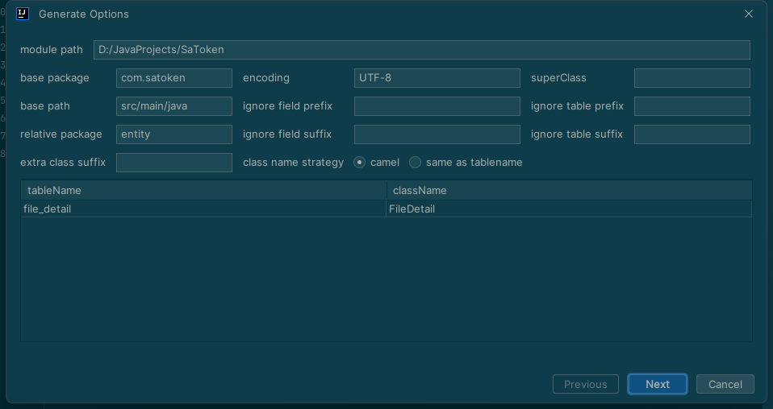
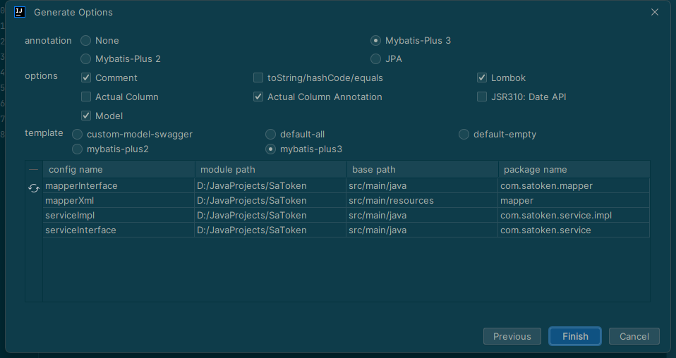
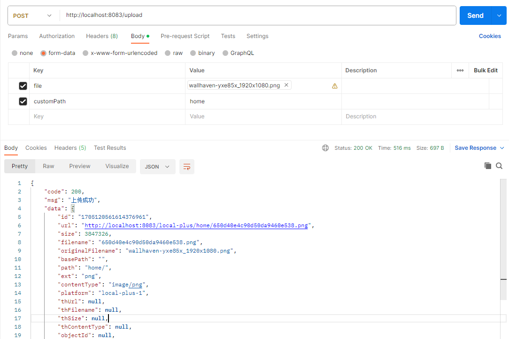
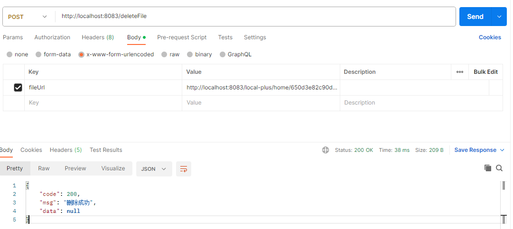
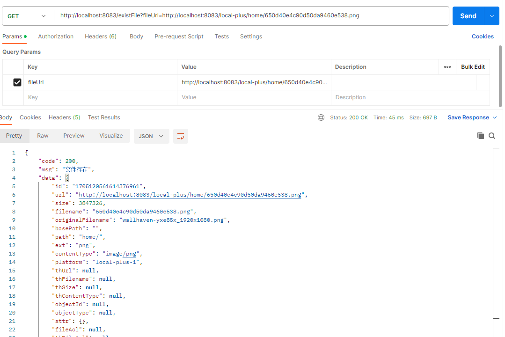

## 介绍
- 在 `SpringBoot` 中通过简单的方式实现文件存储
- [官方文档](https://spring-file-storage.xuyanwu.cn/#/)

## 本地快速使用
### 引入
```xml
<dependency>
  <groupId>cn.xuyanwu</groupId>
  <artifactId>spring-file-storage</artifactId>
  <version>1.0.3</version>
</dependency>
```
### 配置
- application.yml
```yml
spring:
  profiles:
    active: dev
  servlet:
    multipart:
      max-file-size: 1024MB
      max-request-size: 102400MB
```
- application-dev.yml
```yml
spring:
  file-storage:
    default-platform: local-plus-1 #存储平台
    thumbnail-suffix: ".min.jpg" #缩略图后缀
    local-plus:
      - platform: local-plus-1 #存储平台名称
        enable-storage: true  #启用存储
        enable-access: true #启用访问
        domain: http://localhost:8083/local-plus/ #访问域名
        base-path: #基础路径
        path-patterns: /local-plus/** #访问路径
        storage-path: D:/JavaProjects/SaToken/file/ #存储路径
```
### 注入
```java
@EnableFileStorage
@SpringBootApplication
public class SaTokenApplication {

    public static void main(String[] args) {
        SpringApplication.run(SaTokenApplication.class, args);
    }

}
```
### 简单上传
```java
@RestController
public class FileDetailController {

    @Autowired
    private FileStorageService fileStorageService;//注入实列

    @PostMapping("/upload")
    public FileInfo upload(MultipartFile file) {
        return fileStorageService.of(file).upload();
    }

}
```
## 扩展
- 为实现除上传文件外的其它功能，需要实现`FileStorage`接口
- 需要先连接mysql，实现上传记录保存
### 数据库依赖引入
```xml
<dependency>
    <groupId>mysql</groupId>
    <artifactId>mysql-connector-java</artifactId>
    <version>8.0.33</version>
</dependency>
<dependency>
    <groupId>org.springframework.boot</groupId>
    <artifactId>spring-boot-starter-jdbc</artifactId>
</dependency>
```
### 数据库连接配置
```yml
spring:
  datasource:
  driver-class-name: com.mysql.cj.jdbc.Driver
  url: jdbc:mysql://localhost:3306/file?useUnicode=true&characterEncoding=utf-8&userSSL=false&serverTimezone=GMT%2B8
  username: root
  password: 123456
```
### MyBatis-Plus
- 引入
```xml
<dependency>
    <groupId>com.baomidou</groupId>
    <artifactId>mybatis-plus-boot-starter</artifactId>
    <version>3.5.3.1</version>
</dependency>
```
- 使用 `MybatisX-Generator` 生成代码




- 配置 `@MapperScan` 注解

```java
@EnableFileStorage
@SpringBootApplication
@MapperScan("com.satoken.mapper")
public class SaTokenApplication {

    public static void main(String[] args) {
        SpringApplication.run(SaTokenApplication.class, args);
    }

}
```
### 实现 `FileStorage`


## 完整功能
### 上传
- `customPath` 用来配置文件保存位置，默认 `common` 文件夹
- `setProgressMonitor` 监听上传进度
```java
@PostMapping("/upload")
public SaResult upload(MultipartFile file,String customPath) {
    if (customPath == null) {
        customPath = "common";
    }
    FileInfo fileInfo = fileStorageService.of(file)
            .setPath(customPath + "/")
            .setProgressMonitor((progressSize, allSize) ->
                    log.info("已上传: " + progressSize + " 总大小: " + allSize + " 进度: " + (progressSize * 100 / allSize) + "%")
            )
            .upload();
    return SaResult.ok("上传成功").setData(fileInfo);
}
```


### 删除文件
```java
@PostMapping("/deleteFile")
public SaResult deleteFile(String fileUrl) {
    boolean result = fileStorageService.delete(fileUrl);
    return result ? SaResult.ok("删除成功") : SaResult.error("删除失败");
}
```


### 判断文件是否存在
```java
@GetMapping("/existFile")
public SaResult existFile(String fileUrl) {
    try {
        FileInfo fileInfo = fileStorageService.getFileInfoByUrl(fileUrl);
        return SaResult.ok("文件存在").setData(fileInfo);
    } catch (Exception e) {
        return SaResult.error("文件不存在");
    }
}
```
