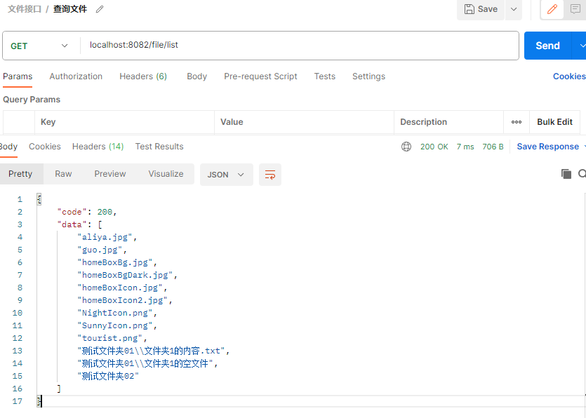

## 文件工具类
- 递归获取目录下的所有文件
```java
/**
 * org.apache.commons.io.FileUtils
 * @param url 目录
 * @param null 不排除任何子目录
 * @param true 包含子目录
 */
Collection<File> files = FileUtils.listFiles(new File(url), null, true);
```

## 文件夹操作Controller层
- ```getFiles()``` 方法用来查询文件夹下的所有文件
```java
@RestController
@RequestMapping("/file")
public class FileController {

    @Autowired
    private FileService fileService;

    @GetMapping("/list")
    public R getFiles(){
        return R.ok().put("data", fileService.getFiles());
    }
}
```

## 定义接口
```java
public interface FileService {

    List<String> getFiles();

}
```

## 接口实现
```java
@Service
public class FileServiceImpl implements FileService {

    @Value("${fileBackPath}")
    private String fileBackUrl;

    @Override
    public List<String> getFiles() {
        File directory = new File(fileBackUrl);
        List<String> list = new ArrayList<>();
        return directoryResolve(directory,list);
    }

    public List<String> directoryResolve(File directory,List<String> list) {
        File[] fileList = directory.listFiles();
        if(fileList != null) {
            if (fileList.length == 0) {
                list.add(replacePath(directory.getPath()));
                return list;
            }
            for(File file : fileList) {
                if(!file.isDirectory()){
                    list.add(replacePath(file.getPath()));
                }else{
                    directoryResolve(new File(file.getPath()),list);
                }
            }
        }
        return list;
    }

    public String replacePath(String path) {
        return path.replace(fileBackUrl,"");
    }

}
```

### 查询结果
