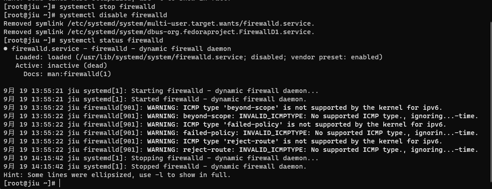

## 第一步：关闭防火墙
- 启动： systemctl start firewalld
- 关闭： systemctl stop firewalld
- 查看状态： systemctl status firewalld 
- 开机禁用： systemctl disable firewalld
- 开机启用： systemctl enable firewalld
### 查看防火墙状态

### 关闭防火墙并设置开机禁用

## 第二步：设置端口映射
- 编辑->虚拟网络编辑器->更改设置

## 第三步：本地访问
