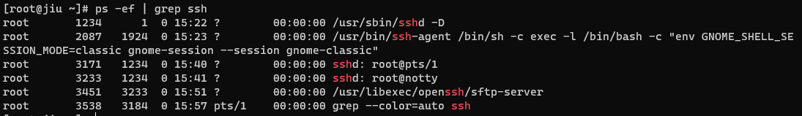
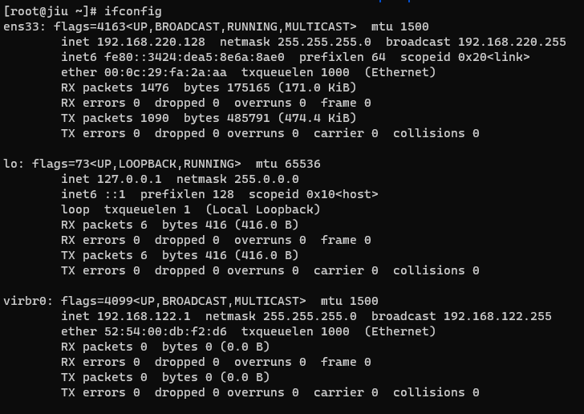

::: tip 开始
Linux是一套免费使用和自由传播的类Unix操作系统，是一个基于POSIX和UNIX的多用户、多任务、支持多线程和多CPU的操作系统，能运行主要的UNIX工具软件、应用程序和网络协议，同时它也支持32位和64位硬件。

CentOS（Community Enterprise Operating System，中文意思是：社区企业操作系统）是Linux发行版之一，它是来自于Red Hat Enterprise Linux依照开放源代码规定释出的源代码所编译而成。CentOS是一个基于Red Hat Linux提供的可自由使用源代码的企业级Linux发行版本，每个版本的CentOS都会获得十年的支持（通过安全更新方式），这样就能建立一个安全、低维护、稳定、高预测性、高重复性的Linux环境。
:::

## 系统目录结构
```sh
bin   dev  home  lib64  mnt  proc  run   srv  tmp  var
boot  etc  lib   media  opt  root  sbin  sys  usr
```
- bin：此目录存放着最经常使用的命令。 
- dev：这个目录包含设备文件，Linux把硬件设备当做文件处理。
- home：用户的主目录，在Linux中，每个用户都有一个自己的目录，一般该目录名是以用户的用户名命名。
- lib64：包含标准的库文件，这些文件包含了一些应用程序和函数库。
- mnt：这是挂载其他文件系统的地方，例如挂载Windows下的C盘、D盘等。
- proc：这个目录是一个虚拟的目录，它是系统内存的映射，可以通过直接访问这个目录来获取系统信息。
- run：这个目录是在系统启动后，保存运行时的文件的地方。
- srv：此目录存放着那些在后台运行的服务程序所需要的数据文件。
- tmp：这个目录是用来存放一些临时文件的。
- var：这个目录存放着在不断扩充着的东西，包括各种日志文件。
- boot：这个目录包含了启动Linux系统所必需的文件，如Linux内核文件（vmlinuz）和引导加载器（grub）。
- etc：这个目录包含系统的配置文件。几乎所有的系统配置都放在这个目录下，例如/etc/passwd存储用户信息，/etc/fstab存储文件系统挂载信息等。
- lib：这个目录包含系统的库文件。这些库文件是编译程序时所需要的。
- media：这个目录通常是挂载其他设备的地方，例如U盘、移动硬盘等。
- opt：这个目录是给主机额外安装软件所存放的目录。比如你安装一个Linux版本的某个软件，它可能会被安装在/opt目录下。
- root：这个目录是系统管理员（root用户）的主目录。
- sbin：这个目录包含系统级的可执行文件。这些程序通常是系统维护和管理所必需的。
- sys：这个目录是一个虚拟文件系统，提供了对内核对象和层次结构的访问。它是Linux2.6版本以后引入的。
- usr：这是一个非常重要的目录，包含了系统中大部分的应用程序和工具。比如你安装一个软件，它可能会被安装在/usr/share/或者/usr/local/目录下。

## 通过ssh远程连接
### 检查ssh
- `which ssh`: 检查ssh是否安装
  - 如果返回了ssh的路径，那就说明ssh已经安装
- `ps -ef | grep ssh`：检查ssh是否启动


- `service sshd start`：启动ssh
### 获取ip地址
```sh
ifconfig
```

### 连接
```sh
ssh root@192.168.220.128
```
- 输入密码后即可在本地终端中执行命令