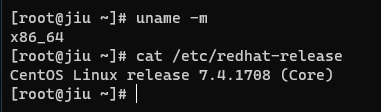
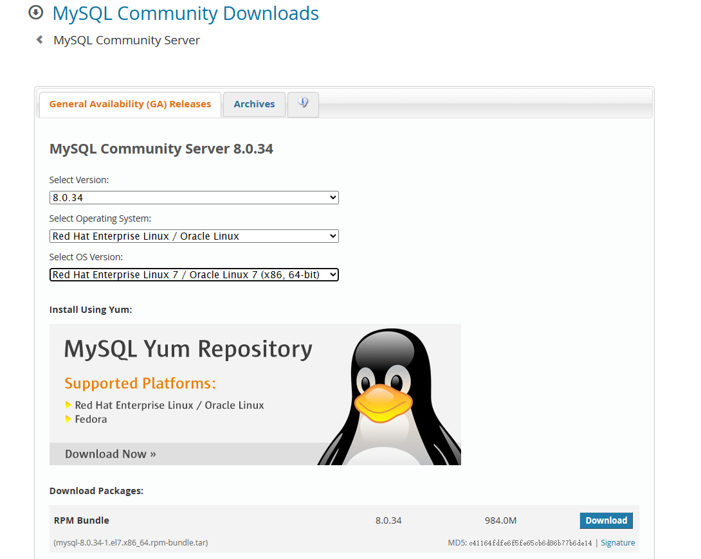
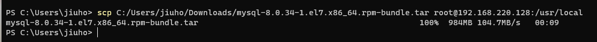
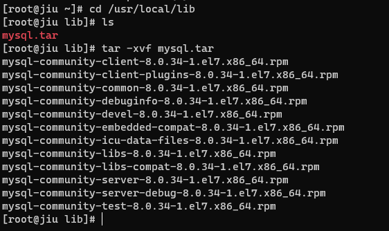
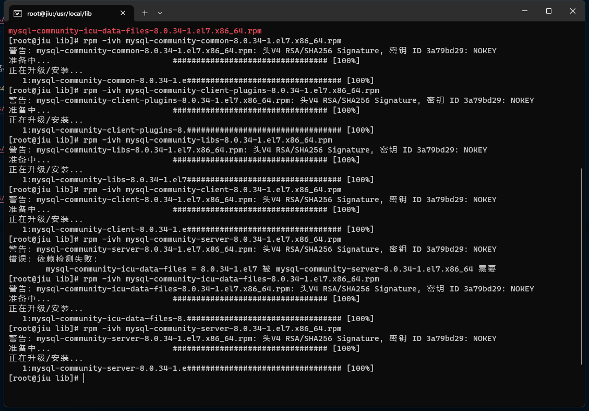
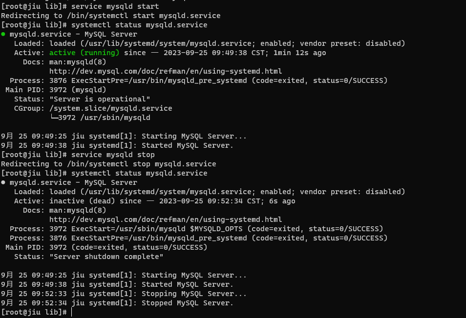
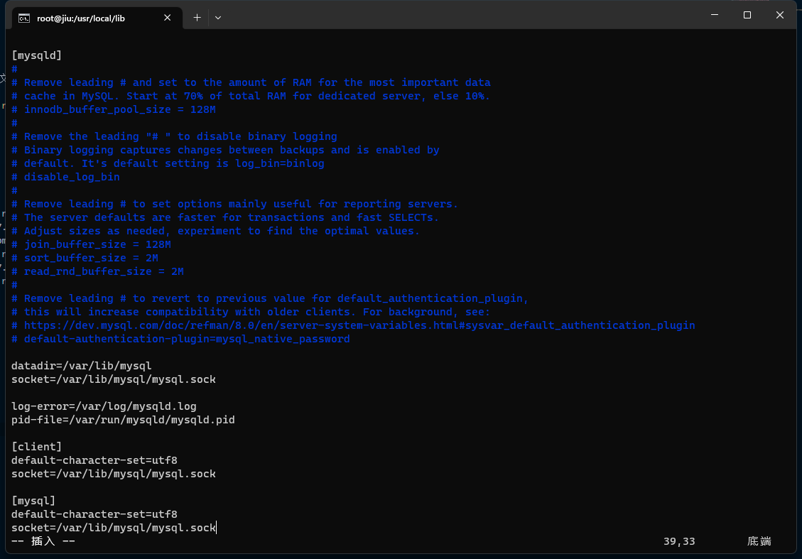
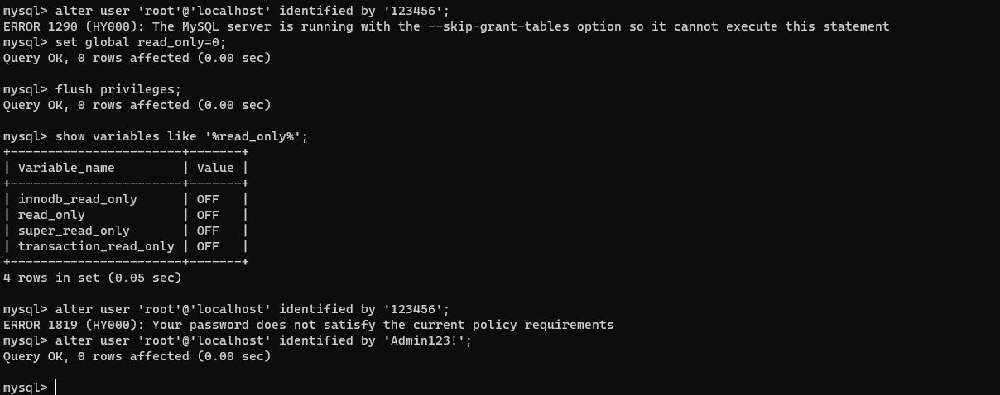

## 检查
- 查看架构
```sh
uname -m
```
- 查看系统版本
```sh
cat /etc/redhat-release
```



- 下载


## 安装
### 上传
- 使用 `scp` 传输压缩包
- scp [本地文件路径] [服务器用户名] @ [服务器地址] : [接收文件路径]
```sh
scp C:/Users/jiuho/Downloads/mysql-8.0.34-1.el7.x86_64.rpm-bundle.tar root@192.168.220.128:/usr/local
```

### 解压
- tar -xvf xx.tar


### rpm 安装
1. rpm -ivh mysql-community-common-8.0.34-1.el7.x86_64.rpm
2. rpm -ivh mysql-community-client-plugins-8.0.34-1.el7.x86_64.rpm
3. rpm -ivh mysql-community-libs-8.0.34-1.el7.x86_64.rpm
4. rpm -ivh mysql-community-client-8.0.34-1.el7.x86_64.rpm
5. rpm -ivh mysql-community-icu-data-files-8.0.34-1.el7.x86_64.rpm
6. rpm -ivh mysql-community-server-8.0.34-1.el7.x86_64.rpm


### 修改目录权限
```sh
chmod -R 777 /var/lib/mysql
```
### 开启关闭


### 修改 `my.conf`



点击`ESC`,按`:wq`保存退出
## 初始化
### 服务初始化
```sh
mysqld --initialize --user=mysql
```
### 获取密码
```sh
cat /var/log/mysqld.log
```
```log
2023-09-25T01:49:35.266696Z 6 [Note] [MY-010454] [Server] A temporary password is generated for root@localhost: QJ_&+WEFv3ke
```
### 设置自启动
```sh
systemctl enable mysqld.service # 允许开机自启
systemctl disable mysqld.service # 禁止开机自启
```
### 启动
```sh
systemctl status mysqld # 查看状态
systemctl start mysqld.service # 启动
```
- mysql命令
  - 查看状态：systemctl status mysqld.service
  - 重启：systemctl restart mysqld.service
  - 启动：systemctl start mysqld.service
  - 停止：systemctl stop mysqld.service

  - 查看状态：service mysqld status
  - 重启：service mysqld restart
  - 启动：service mysqld start
  - 停止：service mysqld stop

## 错误
### 登录错误解决
- ERROR 1045 (28000): Access denied for user 'root'@'localhost' (using password: YES)
1. 修改`/etc/my.conf`,在[mysqld]下加入skip-grant-tables
2. 重启mysql
3. 修改密码,提示：ERROR 1290 (HY000): The MySQL server is running with the --skip-grant-tables option so it cannot execute this statement
4. 执行命令关闭数据库只读属性，再次修改


### 远程无法连接解决
- 1130 - Host "192168,220,1' is not allowed to connect to this MySQL server
1. use mysql;
2. select user,host from user;
3. update user set host = '%' where user = 'root';
4. flush privileges;