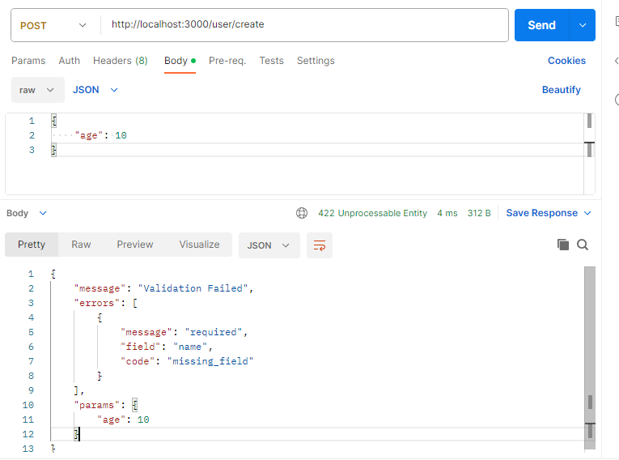

## 简介
Koa 是一个轻量级的 Node.js Web 框架，用于构建可扩展、可维护的服务器端应用程序。Koa 并没有遵循传统的 MVC（Model-View-Controller）架构，而是采用了一种更加灵活和强大的基于生成器的架构。Koa 遵循了 Express.js 的核心思想，但是 Koa 更加简洁、更具可读性和扩展性。

Koa 的特性包括：

- 轻量级：Koa 的安装大小只有 Express.js 的 1/4，这使得 Koa 更加轻量级，易于部署。
- 生成器架构：Koa 采用基于生成器的架构，使得代码更加模块化、易于维护。
- 中间件：Koa 支持中间件，这使得 Koa 可以在请求处理之前或之后执行特定的操作。
- 错误处理：Koa 提供了一个强大的错误处理系统，可以捕获和处理错误。
- 路由：Koa 支持基于正则表达式的路由，可以轻松地创建复杂的 RESTful API。
- 模板引擎：Koa 支持 EJS、Handlebars 等流行的模板引擎，可以轻松地实现页面渲染。
- 集成工具：Koa 集成了一些常用的集成工具，如 Sequelize、Mongoose 等，可以简化数据库操作。
总之，Koa 是一款功能强大、轻量级的 Node.js Web 框架，适用于构建可扩展、可维护的服务器端应用程序。

## 使用
### 安装
```sh
npm install koa --save
```
### 创建一个 Koa 应用
- 访问```localhost:3000```，可以看到```Hello Koa```
```js
const Koa = require('koa');

const app = new Koa();

app.use(ctx => {
  ctx.body = 'Hello Koa';
})

app.listen(3000, () => {
  console.log('[demo] server is starting at port 3000');
});
```

## 中间件
- 当一个中间件调用 next() 则该函数暂停并将控制传递给定义的下一个中间件
- 当在下游没有更多的中间件执行后，堆栈将展开并且每个中间件恢复执行其上游行为
### 执行顺序示例
```js
app.use(async (ctx, next) => {
  console.log('第一个执行');
  await next();
  console.log('第五个执行')
});

app.use(async (ctx, next) => {
  console.log('第二个执行');
  await next();
  console.log('第四个执行')
})

app.use(async (ctx, next) => {
  console.log('第三个执行')
})
```
### 中间件上下文
- ```ctx```：上下文对象，包含了请求对象和响应对象
```js
app.use(async (ctx) => {
  ctx.body = {
    req: ctx.request,
    res: ctx.response
  }
});
```
```json
{
  "req": {
    "method": "POST",
    "url": "/",
    "header": {
      "user-agent": "PostmanRuntime/7.32.3",
      "accept": "*/*",
      "postman-token": "50cff0e5-89dc-4d41-b5a3-d56ff8545234",
      "host": "localhost:3000",
      "accept-encoding": "gzip, deflate, br",
      "connection": "keep-alive",
      "content-length": "0"
    }
  },
  "res": {
    "status": 200,
    "message": "OK",
    "header": {
      "content-type": "application/json; charset=utf-8"
    }
  }
}
```
### 路由
- 路由是 Koa 应用程序中的核心概念
- 路由决定了由谁(哪些中间件)处理请求以及处理请求的什么方法
- 路由由路由器(koa-router)提供
- 安装
```sh
npm i koa-router --save
```
- 引入
```js
const Router = require('koa-router');
const router = new Router();
```
- 使用
```js
router.get('/', async (ctx) => {
  ctx.body = 'Hello koa-router';
})

router.get('/about/:id', async (ctx) => {
  ctx.body = `This is about page, you id ${ctx.params.id}`;
})

app.use(router.routes());
```
- 路由前缀
```js
const userRouter = new Router({
  prefix: '/user'
})

userRouter.get('/:id', async (ctx) => {
  ctx.body = `This is user page, you id ${ctx.params.id}`;
})

app.use(userRouter.routes())
```
- 路由中间件
  - 在路由中使用err中间件，访问则抛出一个包含 status 属性错误的帮助方法
```js
const err = async (ctx, next) => {
  ctx.throw(401, 'Unauthorized');
  await next();
}

userRouter.get('/', auth, async (ctx) => {
  ctx.body = 'Hello user-router';
})
```
### 控制器
#### 获取请求参数
  - ctx.query
  - ctx.params
  - ctx.request.bdoy
- 获取body需要借助bodyParser
- 安装
```sh
npm i koa-bodyparser -save
```
- 使用
```js
const bodyParser = require('koa-bodyparser');
app.use(bodyParser());
```
#### 发送响应
```js
router.get('/', (ctx) => {
  ctx.set('Cache-Control', 'no-cache'); // 发送响应头
  ctx.status = 500; // 发送响应状态码
  ctx.body = '服务器出错了'; // 发送响应体
})
```
#### 封装一个控制层
- 创建一个文件夹controller
- 创建一个UserController.js
```js
const User = require('../models/User');

class UserController { 
  /**
   * 获取用户列表
   * @param {Object} ctx
   * @returns {Promise<void>}
   */
  async getList(ctx) {
    const { page = 1, pageSize = 10 } = ctx.query;
    const result = await User.getList({ page, pageSize });
    ctx.body = result;
  }
}

module.exports = new UserController();
```
- 使用
```js
const { getList } = require('../controller/UserController');
router.get('/', getList);
```
### 错误处理
- 基础的错误处理中间件
  - 捕获 ```ctx.throw(412, 'id不存在')```时
    - 客户端返回 status: 412, {"message":"id不存在"}
  - 捕获内部错误```ctx.body = a``` 时
    - 客户端返回 status: 500, {"message":"a is not defined"}
```js
app.use(async (ctx, next) => {
  try {
    await next();
  } catch (err) {
    ctx.status = err.statusCode || err.status || 500;
    ctx.body = {
      message: err.message
    };
  }
})
```
- koa-json-error
  - 安装
    - ```npm i koa-json-error --save```
  - 引入
    - ```const error = require('koa-json-error')```
  - 使用
    - ```app.use(error())```
```js
app.use(error({
  postFormat: (e, { stack, ...rest }) => {
    if (process.env.NODE_ENV === 'production') {
      return {
        stack,
        ...rest
      }
    } else {
      return rest
    }
  }
}))
```
#### 配置不同环境
- 安装cross-env
```sh
npm i cross-env --save-dev
```
```json
{
  "scripts": {
    "start": "cross-env NODE_ENV=production nodemon app",
    "dev": "node app"
  }
}
```
### 参数效验
- 安装
```sh
npm i koa-parameter --save
```
- 引入
```js
const paramter = require('koa-parameter');
```
- 使用
```js
app.use(paramter(app))
```
- 新增用户参数效验示例
```js
create (ctx) {
  ctx.verifyParams({
    name: {
      type: 'string',
      required: true
    },
    age: {
      type: 'number',
      required: false
    }
  })
  db.push(ctx.request.body)
  ctx.body = '新增成功'
}
```
- 错误参数示例
