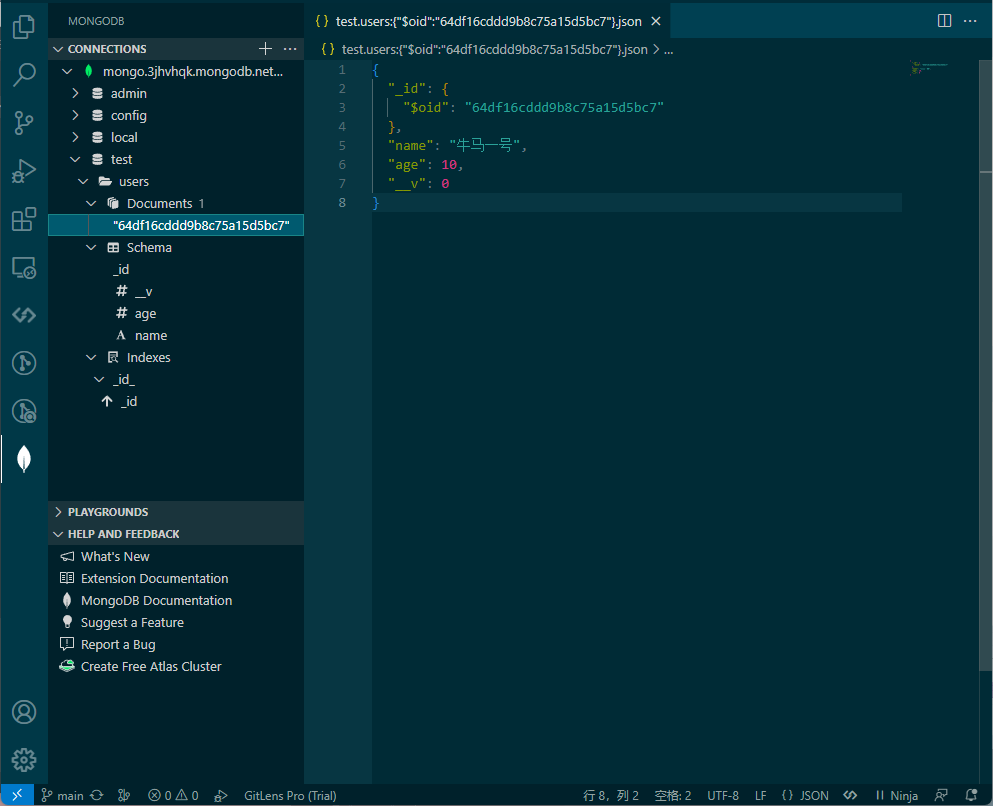

## 初始化

### VSCode中使用
- 使用```MongoDB for VS Code```扩展

### 依赖引入
```sh
npm i mongoose --save
```
### 测试连接
```js
const mongoose = require('mongoose');

mongoose.set("strictQuery", true);
mongoose.connect(url, () => {
  console.log('数据库连接成功')
})
mongoose.connection.on('error', (err) => {
  console.log('数据库连接失败', err)
})
```

## 模式
- [API文档](http://mongoosejs.net/docs/api.html#model_Model)
### 定义用户模型
```js
const mongoose = require('mongoose');

const { Schema, model } = mongoose;

const userSchma = new Schema({
  name: {
    type: String,
    required: true
  },
  age: {
    type: Number,
    required: false
  }
})

module.exports = model('User', userSchma);
```
### 新增用户
```js
async create (ctx) {
  ctx.verifyParams({
    name: {
      type: 'string',
      required: true
    },
    age: {
      type: 'number',
      required: false
    }
  })
  const user = await new User(ctx.request.body).save()
  ctx.body = user
}
```
```json
{
  "name": "牛马二号",
  "age": 10,
  "_id": "64df16cddd9b8c75a15d5bc7",
  "__v": 0
}
```
### 查询用户
```js
async find (ctx) {
  ctx.body = await User.find()
}
async findById (ctx) {
  const user = await User.findById(ctx.params.id)
  if(!user) {
    return ctx.throw(403, '用户不存在')
  }
  ctx.body = user
}
```
### 修改用户
- options有以下选项：
  1. new： bool - 默认为false。返回修改后的数据。
  2. upsert： bool - 默认为false。如果不存在则创建记录。
  3. runValidators： 如果值为true，执行Validation验证。
  4. setDefaultsOnInsert： 如果upsert选项为true，在新建时插入文档定义的默认值。
  5. sort： 如果有多个查询条件，按顺序进行查询更新。
  6. select： 设置数据的返回。
```js
User.findByIdAndUpdate(ctx.params.id, ctx.request.body, { new: true })
```
### 删除用户
```js
User.findByIdAndRemove(ctx.params.id)
```
