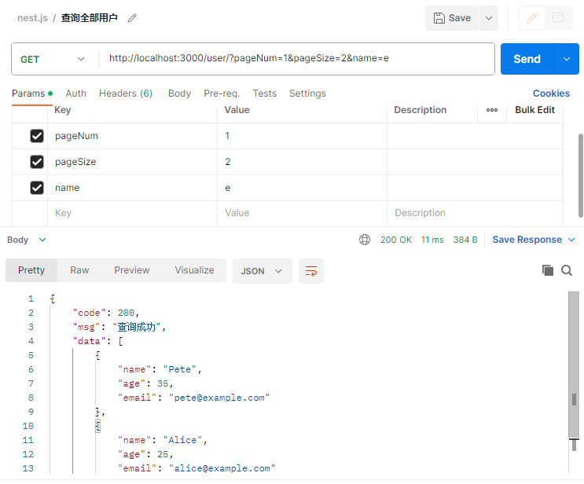

## 开始
- Nest 是一个用于构建高效，可扩展的 ```Node.js``` 服务器端应用程序的框架。它使用渐进式 ```JavaScript```，内置并完全支持 ```TypeScript``` 并结合了 OOP（面向对象编程），FP（函数式编程）和 FRP（函数式响应编程）的元素。
- [中文文档](https://docs.nestjs.cn/10/introduction)
### 全局安装脚手架
```sh
npm i -g @nestjs/cli
```
### 创建项目
```sh
nest new [project-name]
```
### 文件结构
- ```dist```：编译后的文件
- ```src```
  - ```app.controller.spec.ts```：单元测试
  - ```app.controller.ts```：基本控制器
  - ```app.module.ts```：根模块
  - ```app.service.ts```：基本服务
  - ```main.ts```：入口文件，创建应用实例
### 启动项目
```sh
npm run start:dev
```
- 访问```http://localhost:3000/```
  - 返回```Hello World!```
#### 写一个示例接口
```ts
// app.controller.ts
@Get('test')
getTest(): string {
  return this.appService.getTest();
}
// app.service.ts
getTest(): string {
  return '测试测试';
}
```
- 访问```http://localhost:3000/test```
  - 返回```测试测试```

## 简单实现用户层
### 创建用户控制器
```ts
import { Controller, Get } from '@nestjs/common';
import { UserService } from './service';
import { User } from './model';

@Controller('user')
export class UserController {
  constructor(private readonly userService: UserService) {}

  @Get()
  findAllUser(): User[] {
    return this.userService.findAllUser();
  }
}
```
### 创建用户模型
```ts
export interface User {
  name: string;
  age: number;
  email: string;
}

export const UserList: User[] = [
  {
    name: 'John',
    age: 30,
    email: 'john@example.com',
  },
];
```
### 创建用户服务
```ts
import { Injectable } from '@nestjs/common';
import { User, UserList } from './model';

@Injectable()
export class UserService {
  findAllUser(): User[] {
    return UserList;
  }
}
```
### 模块中注册
```ts
import { Module } from '@nestjs/common';
import { UserController } from './user/controller';
import { UserService } from './user/service';

@Module({
  controllers: [UserController],
  providers: [UserService],
})
export class AppModule {}
```
### 自定义返回体
```ts
export interface Result<T> {
  code: number;
  msg: string;
  data?: T;
}

export class ResultUtil {
  static success<T>(data: T): Result<T> {
    return {
      code: 200,
      msg: 'success',
      data,
    };
  }

  static fail<T>(msg: string): Result<T> {
    return {
      code: 500,
      msg,
    };
  }
}
```
### 分页查询，根据用户名查询
```ts
interface Query {
  pageNum: number;
  pageSize: number;
  name: string;
}

@Get()
findAllUser(@Query() query: Query): ResultUtil {
  const { pageNum, pageSize, name } = query;
  return this.userService.findAllUser(pageNum, pageSize, name);
}
```
```ts
/**
 * @param pageNum 第几页
 * @param pageSize 每页多少条
 * @param name 用户名
 * @returns UserList
 */
findAllUser(pageNum: number, pageSize: number, name: string): ResultUtil {
  let userList = UserList;
  if (name) {
    userList = userList.filter((item) => item.name.includes(name));
  }
  userList = userList.slice((pageNum - 1) * pageSize, pageNum * pageSize);
  return ResultUtil.success(userList);
}
```
### 根据id查询
```ts
@Get('findById/:id')
findUserById(@Param('id') id: number): ResultUtil {
  return this.userService.findUserById(id);
}
```
```ts
/**
 * @param id 用户id
 * @returns User
 */
findUserById(id: number): ResultUtil {
  if (id < 1) {
    return ResultUtil.fail('请输入正确的id');
  }
  if (id > UserList.length) {
    return ResultUtil.fail('用户不存在');
  } else {
    return ResultUtil.success(UserList[id - 1]);
  }
}
```
### 新增用户
```ts
@Post('create')
createUser(@Body() body: User): ResultUtil {
  const { name, age, email } = body;
  return this.userService.createUser(name, age, email);
}
```
```ts
/**
 * @param name 用户名
 * @param age 年龄
 * @param email 邮箱
 * @returns User
 */
createUser(name: string, age: number, email: string): ResultUtil {
  if (!name) return ResultUtil.fail('请输入用户名');
  if (!age) return ResultUtil.fail('请输入年龄');
  if (!email) return ResultUtil.fail('请输入邮箱');
  if (UserList.find((item) => item.name === name)) {
    return ResultUtil.fail('用户名已存在');
  }
  UserList.push({ name, age, email });
  return ResultUtil.success(UserList[UserList.length - 1]);
}
```
### 修改用户
```ts
@Put('upload/:id')
updatedUserById(@Param('id') id: number, @Body() body: User): ResultUtil {
  const { name, age, email } = body;
  return this.userService.updateUserById(id, name, age, email);
}
```
```ts
/**
 * @param id 用户id
 * @param name 用户名
 * @param age 年龄
 * @param email 邮箱
 * @returns User
 */
updateUserById(
  id: number,
  name: string,
  age: number,
  email: string,
): ResultUtil {
  const user = UserList[id - 1];
  if (!user) return ResultUtil.fail('用户不存在');
  if (name) user.name = name;
  if (age) user.age = age;
  if (email) user.email = email;
  UserList[id - 1] = user;
  return ResultUtil.success(user);
}
```
### 删除用户
```ts
@Delete('delete/:id')
deleteUserById(@Param('id') id: number): ResultUtil {
  return this.userService.deleteUserById(id);
}
```
```ts
/**
 * @param id 用户id
 * @returns null
 */
deleteUserById(id: number): ResultUtil {
  if (id < 1 || id > UserList.length) return ResultUtil.fail('用户不存在');
  UserList.splice(id - 1, 1);
  return ResultUtil.success(null);
}
```
### Postman测试接口
- 查询全部用户


- 根据条件查询



- 根据id查询


- 新增用户


- 修改用户


- 删除用户

