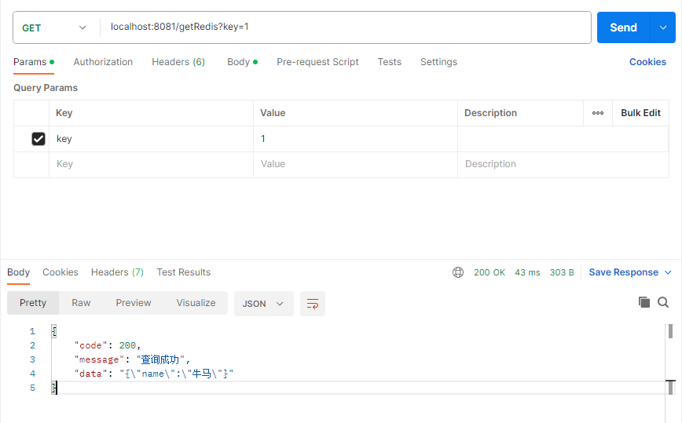
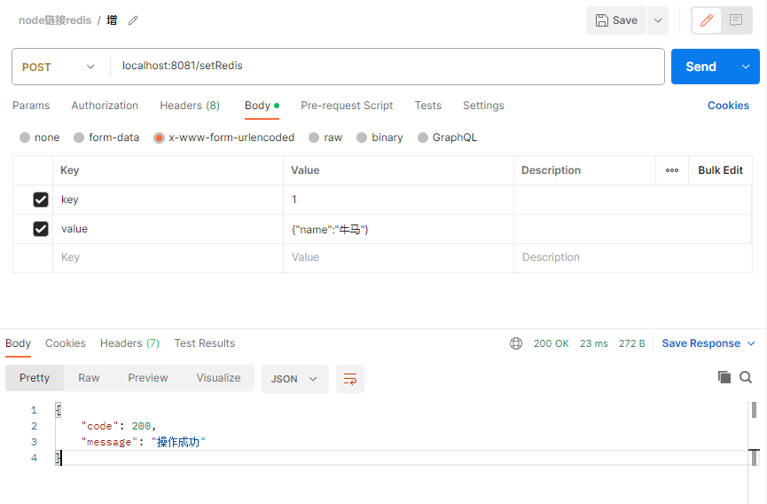

## 初始化
### 安装
```sh
npm install redis
```
### 使用
- 本地直接链接
```js
const { createClient }  = require('redis')

const client = createClient()

client.on('error', err => {
    console.log('Redis Client Error', err)
})

client.on('ready', () => {
    console.log('redis链接成功')
})

const serve = async () => {
    await client.connect()

    // 插入字符串
    await client.set('测试数据插入001', '我是字符串数据')
    const value1 =  await client.get('测试数据插入001')
    console.log(value1)
    // 插入对象

    await client.set('测试数据插入002', JSON.stringify({name: '测试数据', value: '哈哈哈哈'}))
    const value2 =  await client.get('测试数据插入002')
    console.log(JSON.parse(value2))

    // 插入map, 如果存在，则插入失败
    await client.hSet('测试数据插入003', '测试key', '测试value')
    const value3 = await client.hGetAll('测试数据插入003')
    const value4 = await client.hGet('测试数据插入003', '测试key')
    console.log(value3)
    console.log(value4)
}

serve()
```
- 结果


- 关闭
```js
client.disconnect();
```

### 基本操作
- 字符串
```js
// 增加
client.set('key', 'value');
// 获取
client.get('key', function(err, value) {
    console.log(value);
});
// 删除
client.del('key');
```
- hash
```js
// 在散列里面关联起给定的键值对
client.hset('hash-key', 'sub-key', 'value');
// 获取指定散列键的值
client.hget('hash-key', 'sub-key' function(err, value) {
    console.log(value);
});
// 获取散列包含的键值对
client.hgetall('hash-key', function(err, value) {
    console.log(value);
});
// 如果给定键存在于散列里面，则移除这个键
client.hdel('hash-key', 'sub-key');
```
- 其它
```js
// 查询一个key是否存在
client.exists('key');
// 设置一个key的过期的秒数
client.expire('key', 'seconds');
// 设置一个key的过期的毫秒数
client.pexpire('key', milliseconds)
// 设置一个UNIX时间戳的过期时间
client.expireat('key', timestamp)
// 设置一个UNIX时间戳的过期时间(毫秒)
client.pexpireat('key', milliseconds-timestamp)
// 移除key的过期时间
client.persist('key');
```

## 远程连接
### 格式
```js
createClient({
  url: 'redis[s]://[[username][:password]@][host][:port][/db-number]'
});
```
### 无密码直连
```js
const ip = ''
const host = ''
const database = ''
createClient({
    url: `redis://${ip}:${host}/${database}`
})
```

## 结合express
### 配置解析表单的中间件
```js
app.use(express.urlencoded({ extended:false }))
```
### 返回结果封装
```js
const successMsg = (message,data) => {
    return {
        code : 200,
        message,
        data
    }
}

const errMsg = (code,message) => {
    return {
        code,
        message
    }
}
```
### 查询
```js
app.get('/getRedis', async (req, res) => {
    const exists = await client.exists(req.query.key)
    if(!exists){
        return res.send(errMsg(500,"Redis中没有这个key"))
    }
    const result = await client.get(req.query.key)
    res.send(successMsg("查询成功",result))
})
```

### 插入
```js
app.post('/setRedis', async (req,res) => {
    const result = await client.set(req.body.key, req.body.value)
    if(result == 'OK'){
        res.send(successMsg("操作成功"))
    }else{
        res.send(errMsg(500,"插入失败"))
    }
})
```
