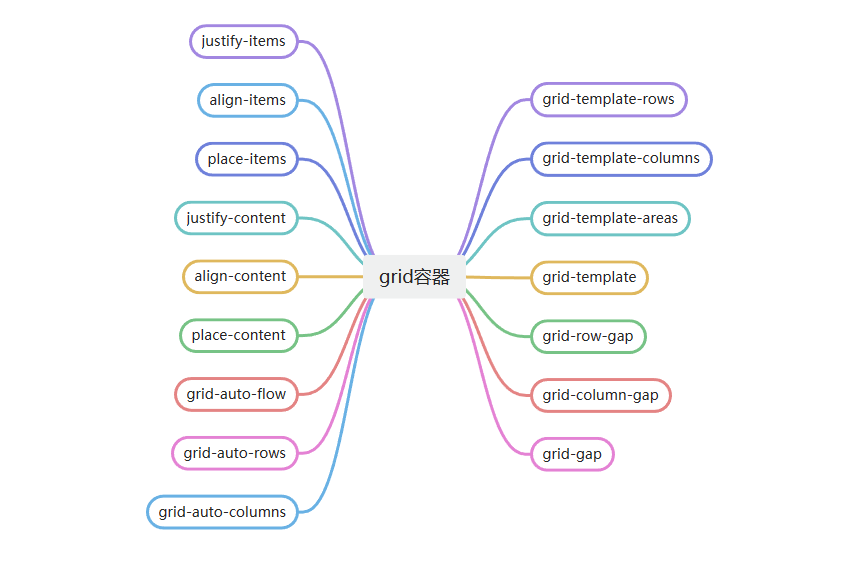
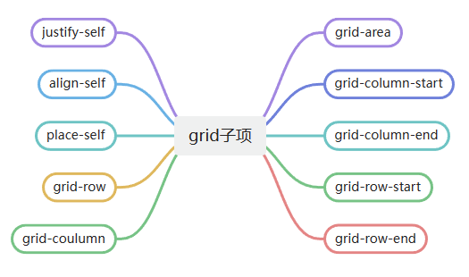
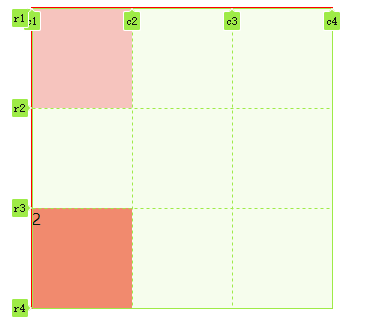

:::tip 前言
CSS网格是一个用于web的二维布局系统。利用网格，可以把内容按照行与列的格式进行排版。另外，网格还能非常轻松地实现一些复杂的布局
[mdn文档](https://developer.mozilla.org/zh-CN/docs/Web/CSS/grid)
:::

## grid容器
- 一个网格通常具有许多的列（column）与行（row），以及行与行、列与列之间的间隙，这个间隙一般被称为沟槽（gutter）

### 定义网格
```css
display: grid;
grid-template-columns: ; // 基于网格列的维度，去定义网格线的名称和网格轨道的尺寸大小。
grid-template-rows: ; // 基于 网格行的维度，去定义网格线的名称和网格轨道的尺寸大小。
```
### fr单位
```css
grid-template-columns: 1fr 1fr 1fr; // 分成三份，各占一份
grid-template-columns: 0.2fr 0.2fr; // 各占20%，剩余60%空余
grid-template-columns: 100px 1fr 1fr; // 减去100px后分俩份
```
### 网格命名
::: normal-demo grid-template-areas grid-area
```html
<div class="main">
    <div>1</div>
    <div>2</div>
    <div>3</div>
</div>
```
```css
.main {
    width: 300px;
    height: 300px;
    margin: auto;
    display: grid;
    grid-template-columns: 1fr 1fr 1fr;
    grid-template-rows: 1fr 1fr 1fr;
    grid-template-areas: 
    "a1 a1 a2"
    "a1 a1 a2"
    "a3 a3 a3"
    ;
}
.main div {
    background-color: pink;
    border: 3px solid #fff;
    box-sizing: border-box;
}
.main div:nth-child(1) {
    grid-area: a1;
}
.main div:nth-child(2) {
    grid-area: a2;
}
.main div:nth-child(3) {
    grid-area: a3;
}
```
:::
#### 简写
- 定义网格中行(grid-template-rows)、列(grid-template-columns)与分区(grid-template-columns)
```css
grid-template: 
"a1 a1 a2" 1fr
"a1 a1 a2" 1fr
"a3 a3 a3" 1fr
/ 1fr 1fr 1fr;
```
### 网格间隙
#### 旧的写法
- grid-row-gap：行间距
- grid-column-gap：列间距
- grid-gap: 行间距 列间距;
#### 标准写法
- row-gap：行间距
- column-gap：列间距
- gap: 行间距 列间距;
::: normal-demo grid间隙demo
```html
<div class="main">
    <div>1</div>
    <div>2</div>
    <div>3</div>
</div>
```
```css
.main {
    width: 300px;
    height: 300px;
    margin: auto;
    display: grid;
    grid-template: 
    "a1 a1 a2" 1fr
    "a1 a1 a2" 1fr 
    "a3 a3 a3" 1fr
    / 1fr 1fr 1fr;
    gap: 20px 30px;
}
.main div {
    background-color: pink;
    border: 1px solid #000;
    box-sizing: border-box;
}
.main div:nth-child(1) {
    grid-area: a1;
}
.main div:nth-child(2) {
    grid-area: a2;
}
.main div:nth-child(3) {
    grid-area: a3;
}
```
:::
### 网格对齐方式
#### 子项小于单元格时
```css
justify-items: start | center | end; // 左 中 右
align-items: start | center | end; // 上 中 下
place-items: <align-items> <justify-items>; // 简写
```
::: normal-demo 元素对齐方式
```html
<div class="main">
    <div>1</div>
    <div>2</div>
    <div>3</div>
    <div>4</div>
    <div>5</div>
    <div>6</div>
    <div>7</div>
    <div>8</div>
    <div>9</div>
</div>
```
```css
.main {
    width: 300px;
    height: 300px;
    margin: auto;
    border: 1px solid red;
    display: grid;
    grid-template-columns: 100px 100px 100px;
    grid-template-rows: 100px 100px 100px;
    place-items: center center;
}
.main div {
    width: 50px;
    height: 50px;
    background-color: pink;
    border: 1px solid #000;
    box-sizing: border-box;
}
```
:::
#### 单元格小于容器
```css
justify-content: center | start | end | space-between | space-around | space-evenly;
align-content: center | start | end | space-between | space-around | space-evenly;
place-content: <align-content> <justify-content>;
```
::: normal-demo 格子对齐方式
```html
<div class="main">
    <div>1</div>
    <div>2</div>
    <div>3</div>
    <div>4</div>
    <div>5</div>
    <div>6</div>
    <div>7</div>
    <div>8</div>
    <div>9</div>
</div>
```
```css
.main {
    width: 300px;
    height: 300px;
    margin: auto;
    border: 1px solid red;
    display: grid;
    grid-template-columns: 80px 80px 80px;
    grid-template-rows: 80px 80px 80px;
    place-items: center center;
    place-content: end space-around;
}
.main div {
    width: 50px;
    height: 50px;
    background-color: pink;
    border: 1px solid #000;
    box-sizing: border-box;
}
```
:::
### 显式网格与隐式网格
- 显式网格是用 grid-template-columns 或 grid-template-rows 属性创建的
- 隐式网格则是当有内容被放到网格外时才会生成的
- 显式网格与隐式网格的关系与弹性盒子的 main 和 cross 轴的关系有些类似
- 隐式网格中生成的行/列大小是参数默认是 auto ，大小会根据放入的内容自动调整
- 可以使用grid-auto-rows和grid-auto-columns属性手动设定隐式网格轨道的大小
- 隐式网格就是为了放显式网格放不下的元素，浏览器根据已经定义的显式网格自动生成的网格部分。
::: normal-demo 自适应行
```html
<div class="main">
    <div>1</div>
    <div>2</div>
    <div>3</div>
    <div>4</div>
    <div>5</div>
</div>
```
```css
.main {
    width: 300px;
    height: 300px;
    margin: auto;
    border: 1px solid red;
    display: grid;
    grid-template-columns: 1fr 1fr 1fr;
    grid-template-rows: 100px;
    grid-auto-flow: row;
    grid-auto-rows: 100px;
}
.main div {
    background-color: pink;
    border: 1px solid #000;
    box-sizing: border-box;
}
```
:::
::: normal-demo 自适应列
```html
<div class="main">
    <div>1</div>
    <div>2</div>
    <div>3</div>
    <div>4</div>
    <div>5</div>
</div>
```
```css
.main {
    width: 300px;
    height: 300px;
    margin: auto;
    border: 1px solid red;
    display: grid;
    grid-template-columns: 100px;
    grid-template-rows: 1fr 1fr 1fr;
    grid-auto-flow: column;
    grid-auto-columns: 100px;
}
.main div {
    background-color: pink;
    border: 1px solid #000;
    box-sizing: border-box;
}
```
:::
## grid子项

### 基于线的元素放置
- 指定从那条线开始到哪条线结束，默认值auto
```css
grid-column-start: <auto>;
grid-column-end: <auto>;
grid-row-start: <auto>;
grid-row-end: <auto>;
// 简写
grid-column: <起始值> / <结束值>;
grid-row: <起始值> / <结束值>;
```
- 网格线的命名
```css
grid-template-columns: [c1] 1fr [c2] 1fr [c3] 1fr [c4];
grid-template-rows: [r1] 1fr [r2] 1fr [r3] 1fr [r4];
```

#### grid-area
- 通过基线（line），跨度（span）或没有（自动）的网格放置在 grid row 中指定一个网格项的大小和位置，继而确定 grid area 的边界
```css
grid-area: <grid-row-start> / <grid-column-start> / <grid-row-end> / <grid-column-end>;
```
::: normal-demo 基于线的元素放置示例
```html
<div class="main">
    <div>1</div>
    <div>2</div>
</div>
```
```css
.main {
    width: 300px;
    height: 300px;
    margin: auto;
    border: 1px solid red;
    display: grid;
    grid-template-columns: [c1] 1fr [c2] 1fr [c3] 1fr [c4];
    grid-template-rows: [r1] 1fr [r2] 1fr [r3] 1fr [r4];
}
.main div:nth-child(1) {
    background-color: pink;
    grid-column-start: c1;
    grid-column-end: c2;
    grid-row-start: r1;
    grid-row-end: r2;
}
.main div:nth-child(2) {
    background-color: salmon;
    grid-area: r3 / c1 / r4 / c3;
}
```
:::
### 子项的对齐方式
```css
justify-self: start | center | end;
align-self: start | center | end;
```
## 函数
### repeat()
- repeat() 函数表示轨道列表的重复片段，允许以更紧凑的形式写入大量显示重复模式的列或行。
- 该函数可以用于 CSS Grid 属性中 grid-template-columns 和 grid-template-rows.
- [更多信息](https://developer.mozilla.org/zh-CN/docs/Web/CSS/repeat)
```css
grid-template-columns: 100px 100px 100px;
grid-template-columns: repeat(3, 100px);
```
```css
grid-template-columns: 150px 100px 100px;
grid-template-columns: 150px repeat(2, 100px);
```
- 根据容器大小自动调节网格数量
```css
grid-template-columns: repeat(auto-fill, 100px);
```
### minmax()
- minmax() 函数定义了一个长宽范围的闭区间
- minmax(<最小值>, <最大值>)
- 如果 最大值 < 最小值，则最大值被忽略并且 minmax(最小值, 最大值) 被看成最小值
```css
grid-template-columns: 100px minmax(100px, 1fr) 100px;
```
## 案例
### 组合排列布局
::: normal-demo grid-area的使用
```html
<div class="main">
    <div>1</div>
    <div>2</div>
    <div>3</div>
    <div>4</div>
    <div>5</div>
    <div>6</div>
</div>
```
```css
.main {
    width: 300px;
    height: 300px;
    margin: auto;
    display: grid;
    grid-template-columns: 1fr 1fr 1fr;
    grid-template-rows: 1fr 1fr 1fr;
    gap: 5px;
}
.main div {
    background-color: indianred;
}
.main div:nth-child(1) {
    background-color: pink;
    grid-area: 2 / 2 / span 2 / span 2;
}
```
:::
### 后台布局模板
::: normal-demo 网格命名与基于线放置
```html
<div class="main">
    <div>header</div>
    <div>left</div>
    <div>center</div>
    <div>right</div>
    <div>footer</div>
</div>
```
```css
.main {
    width: 100%;
    display: grid;
    grid-template-columns: 10% 1fr 10%;
    grid-template-rows: 50px 200px 50px;
    gap: 10px;
    /* grid-template-areas: 
    "header header header"
    "left center right"
    "footer footer footer"
    ; */
}
.main div {
    background-color: pink;
    display: flex;
    justify-content: center;
    align-items: center;
}
.main div:nth-child(1) {
    /* grid-area: header; */
    grid-area: 1 / 1 / span 1 / span 3;
}
.main div:not(:nth-child(1),:nth-child(5)) {
    background-color: lightblue;
}
.main div:nth-child(5) {
    /* grid-area: footer; */
    grid-area: 3 / 1 / span 1 / span 3;
}
```
:::
### display: inline-grid;的使用
::: normal-demo 父容器自适应
```html
<div class="main">
    <div>1</div>
    <div>2</div>
    <div>3</div>
    <div>4</div>
    <div>5</div>
    <div>6</div>
    <div>7</div>
    <div>8</div>
    <div>9</div>
    <div>10</div>
</div>
```
```css
.main {
    display: inline-grid;
    grid-template-columns: 100px;
    grid-template-rows: repeat(2, 1fr);
    grid-auto-flow: column;
    grid-auto-columns: 100px;
    gap: 10px;
    padding: 10px;
    background-color: aquamarine;
}
.main div {
    width: 100px;
    height: 100px;
    background-color: pink;
}
```
:::