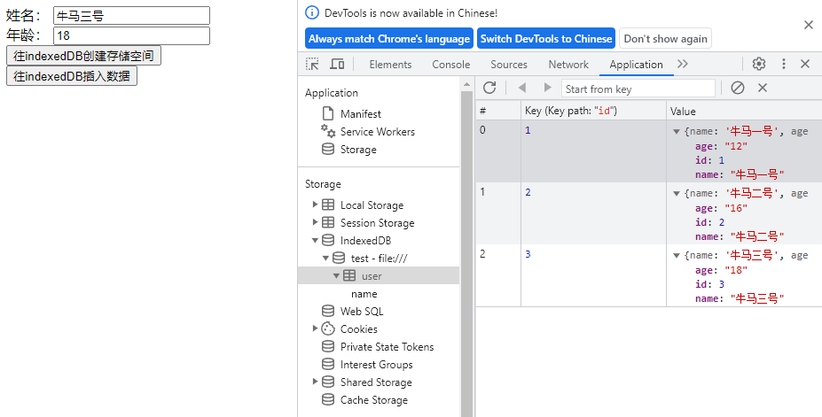
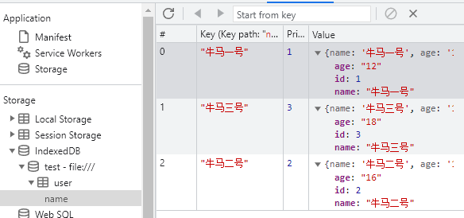
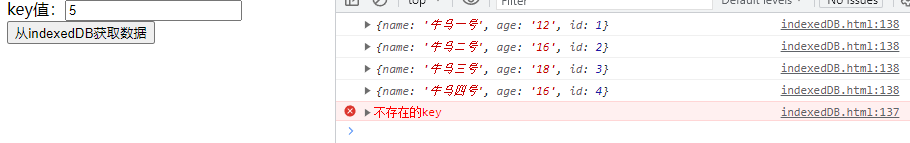
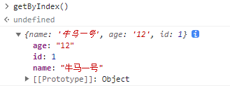
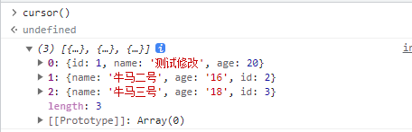

## 介绍
```indexedDB``` 是 ```WindowOrWorkerGlobalScope``` 的一个只读属性，它集成了为应用程序提供异步访问索引数据库的功能的机制
```IndexedDB``` 是一种底层 API，用于在客户端存储大量的结构化数据（也包括文件/二进制大型对象（blobs））
### 基本概念
- IndexedDB 是一个事务型数据库系统，类似于基于 SQL 的 RDBMS
- 数据库：一个数据库由多个对象组成，每个对象都有一个名称，称为键，键值唯一标识一个对象
- 对象存储：对象存储是数据库中一个对象，对象存储可以包含多个属性，每个属性都包含一个键和值
- 索引：索引是数据库中一个对象，它包含一个键和一个值，它允许快速访问数据库中的对象
- 事务：事务是数据库中一个对象，它包含一组操作，这些操作要么全部执行，要么全部不执行
### 基本模式
- 打开数据库。
- 在数据库中创建一个对象仓库（object store）。
- 启动一个事务，并发送一个请求来执行一些数据库操作，像增加或提取数据等。
- 通过监听正确类型的 DOM 事件以等待操作完成。
- 在操作结果上进行一些操作（可以在 request 对象中找到）

## 简单使用
### 打开数据库
- open([数据库名称], [数据库版本号])
- 如果没有打开的数据库，则创建一个数据库
- open 请求不会立即打开数据库或者开始一个事务。
- 对 open() 函数的调用会返回一个我们可以作为事件来处理的包含 result（成功的话）或者错误值的 IDBOpenDBRequest (en-US) 对象
- 当创建一个新的数据库或者增加已存在的数据库的版本号（当打开数据库时，指定一个比之前更大的版本号）， ```onupgradeneeded``` 事件会被触发
```js
var request = window.indexedDB.open("test")
request.onerror = function (event) {

};
request.onsuccess = function (event) {

};
request.onupgradeneeded = function (event) {

}
```
### 创建对象存储空间
- 1. 存储空间的名字
- 2. 指定key值，是否自增
```js
request.onupgradeneeded = function (event) {
  var db = event.target.result;

  var objectStore = db.createObjectStore("user", {
        keyPath: 'id',
        autoIncrement: true
    })
};

```
### 创建索引
- 1. 索引的名字
- 2. 指定根据存储数据的哪一个属性来构建索引
- 3. options对象 unique：是否 允许索引值相等
```js
objectStore.createIndex("name","name", {
    unique: false
})
```
### 创建事务
- 1. 关联的存储空间
- 2. 事务模式: readOnly(只读),readwrite(读写),versionchange(数据库版本变化)
```js
var transaction = db.transaction(["user"], "readwrite");
// 在所有数据添加完毕后的处理
transaction.oncomplete = function (event) {
  alert("All done!");
};
// 错误处理
transaction.onerror = function (event) {

};
```
### 插入数据示例
```html
姓名： <input id="name" /><br />
年龄： <input id="age" /><br />
<button onclick="createDb()">往indexedDB创建存储空间</button>
<button onclick="add()">往indexedDB插入数据</button>
```
```js
function add() {
    const name = document.getElementById('name').value
    const age = document.getElementById('age').value
    var request = window.indexedDB.open('test', 1)
    request.onerror = e => {
        console.error(e)
    }
    request.onsuccess = e => {
        var db = e.target.result
        var transaction = db.transaction(["user"], "readwrite")
        transaction.oncomplete = function (event) {
            console.log('全部完成')
        };

        transaction.onerror = function (event) {
            console.error('错误',event)
        };

        var store = transaction.objectStore("user")
        store.add({
            name,
            age
        })
    }
}

function createDb() {
    var request = window.indexedDB.open('test', 1)

    request.onupgradeneeded = e => {
        var db = e.target.result
        var objectStore = objectStore = db.createObjectStore("user", {
            keyPath: 'id',
            autoIncrement: true
        })
        objectStore.createIndex("name","name", {
            unique: false
        })
    }
}
```


- 索引



### 根据key获取数据
```html
key值：<input id="key"/>
<button onclick="get()">从indexedDB获取数据</button>
```
```js
function get() {
    const key = document.getElementById('key').value
    var requestDB = window.indexedDB.open('test', 1)
    requestDB.onsuccess = e => {
        var db = e.target.result
        var transaction = db.transaction(["user"]);
        var objectStore = transaction.objectStore("user");
        var request = objectStore.get(Number(key));
        request.onerror = e => {
            console.error(e)
        }
        request.onsuccess = e => {
            if(e.target.result == undefined) return console.error('不存在的key')
            console.log(e.target.result)
        }
    }
}
```
- 代码简化
```js
db.transaction("user").objectStore("user").get(Number(key)).onsuccess = e => {
    console.log(e.target.result)
}
```

### 根据索引获取数据
```js
function getByIndex() {
    var requestDB = window.indexedDB.open('test', 1)
    requestDB.onsuccess = e => {
        var db = e.target.result
        var index = db.transaction("user").objectStore("user").index("name")
        index.get("牛马一号").onsuccess = e => {
            console.log(e.target.result)
        }
    }
}
```

### 使用游标获取全部数据
```js
function cursor() {
    var requestDB = window.indexedDB.open('test', 1)
    var list = []
    requestDB.onsuccess = e => {
        var db = e.target.result
        var cursorRequest = db.transaction("user").objectStore("user").openCursor()
        cursorRequest.onsuccess = e => {
            var data = e.target.result
            if(data) {
                list.push(data.value)
                data.continue()
            }else{
                console.log(list)
            }
        }
        cursorRequest.onerror = e => {
            console.error(e)
        }
    }
}
```

### 删除数据
```js
function del() {
    const key = document.getElementById('key').value
    var requestDB = window.indexedDB.open('test', 1)
    requestDB.onsuccess = e => {
        var db = e.target.result
        db.transaction(["user"], "readwrite").objectStore("user").delete(Number(key)).onsuccess = e => {
            console.log('删除成功')
        }
    }
}
```
### 修改数据
- ```put()```方法不仅可以修改数据也可以插入数据
```js
function update() {
    var request = window.indexedDB.open('test', 1)
    request.onsuccess = e => {
        var db = e.target.result
        var store = db.transaction(["user"], "readwrite").objectStore("user")
        var updateRequest = store.put({
            id: 1,
            name: '测试修改',
            age: 20
        })
        updateRequest.onerror = e => {
            console.error(e)
        }
        updateRequest.onsuccess = e => {
            console.log('数据修改完成')
        }
    }
}
```

## 结合localforage
### 创建仓库
```js
import localforage from 'localforage';

const store = localforage.createInstance({
  name: 'file'
})
```
### 删除仓库
```js
const delStore = async () => {
  try {
    await localforage.dropInstance({
      name: 'file'
    })
    console.log('删除仓库成功')
  } catch (error) {
    console.error(error)
  }
}
```
### 新增数据
- reactive定义的数据需要转为原始数据
```js
import { reactive,toRaw } from 'vue'

const form = reactive({
  name: '',
  age: ''
})

const add = async () => {
  try {
    await store.setItem(form.name, toRaw(form))
    form.name = ''
    form.age = ''
  } catch (error) {
    console.error(error)
  }
}
```
### 根据key删除数据
```js
const del = async () => {
  if(!form.name) return
  try {
    await store.removeItem(form.name)
    console.log('删除成功')
  } catch (error) {
    console.error(error)
  }
}
```
### 删除所有数据
```js
const clear = async () => {
  try {
    await store.clear()
    console.log('删除所有数据成功')
  } catch (error) {
    console.error(error)
  }
}
```
### 获取key的数量
```js
const getKey = async () => {
  try {
    const res = await store.length()
    console.log(res)
  } catch (error) {
    console.error(error)
  }
}
```
### 获取所有key
```js
const getKeys = async () => {
  try {
    const res = await store.keys()
    console.log(res)
  } catch (error) {
    console.error(error)
  }
}
```
### 迭代所有数据
```js
const obj = {}
const iterate = () => {
  store.iterate((value,key,iterationNumber) => {
    obj[key] = value
  }).finally(() => {
    console.log(obj)
  })
}
```