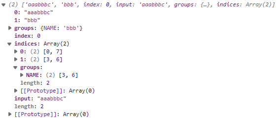

## 简介
- ECMAScript 是 JavaScript 语言的规则
- 2015年正式发布的ECMAScript6（2015）已经成为了JavaScript这门语言的下一代标准
## ECMAScript2015(ES6)
### 作用域
:::tip 作用域链
- 任何一个作用域链都是一个堆栈，首先先把全局作用域压入栈底，再按照函数的嵌套关系一次压入堆栈
- 在执行的时候就按照这个作用域链寻找变量
:::
- 全局作用域：```global/window```
  - 变量在函数或者代码块 {} 外定义，即为全局作用域 
  - 在函数或者代码块 {} 内未定义的变量也是拥有全局作用域的
- 函数作用域（局部作用域）：```function```
  - 在函数内部定义的变量，就是局部作用域
  - 函数作用域内，对外是封闭的，从外层的作用域无法直接访问函数内部的作用域
- 块状作用域：```{}```
  - ```{}```里面的变量就是拥有这个块状作用域,```{}```之外无法访问
- 动态作用域：```this```
  - 只能在执行阶段才能决定变量的作用域
### let
- 不属于顶层对象window
- 不允许重复声明
- 不存在变量提升
- 暂时性死区
  - 如果区块中存在 ```let``` 和 ```const``` 命令，这个区块对这些命令声明的变量，从一开始就形成了封闭作用域
  - 凡是在声明之前就使用这些变量，就会报错
```js
var a = 5
if (true) {
    a = 6
    let a
}
// Uncaught ReferenceError: Cannot access 'a' before initialization
```
- 块级作用域
### const
- 具有 ```let``` 的特性
- 声明的是常量，不可被修改
  - ```const``` 实际上保证的并不是变量的值不得改动，而是变量指向的那个内存地址所保存的数据不得改动
  - 基本数据类型存储在 ```栈内存``` 中，引用数据类型存储在 ```堆内存``` 中然后在栈内存中保存 引用地址
::: tip es5中定义常量的方法
```js
Object.defineProperty(window, 'a', {
    value: 1,
    writable: false
})
a = 999
console.log(a) // 1
```
:::
### 解构赋值
- 数组
```js
let [a,b,c] = [1,2,3]

// ...接受赋值数组的剩余元素
let [name,age,...other] = ["ggb","18","爱吃超级棒棒糖","死猪"]
console.log(name,age,other) // ggb 18 ['爱吃超级棒棒糖', '死猪']

// 赋予默认值
let [name = "猪猪侠", age = 18] = ["GGB"]
console.log(name,age) // GGB 18
```
- 对象
```js
let user = {
    name: '猪猪侠',
    age: 18,
    nickname: 'GGB'
}

let {name,age,nickname} = user
console.log(name,age,nickname) // 猪猪侠 18 GGB

// 自定义变量名
let {name: n} = user
console.log(n) // 猪猪侠

// 默认值
let {name = '猪', msg = "我是GGB"} = user
console.log(name, msg) // 猪猪侠 我是GGB

// ...剩余元素
let {name, ...other} = user
console.log(name, other) // 猪猪侠 {age: 18, nickname: 'GGB'}
```
- 字符串
```js
let str = 'Java'
let [s1,...s2] = str
console.log(s1,s2) // J ['a', 'v', 'a']
```
### Array.map()
- 返回新的数组，每个元素为调用方法后的结果
```js
let arr = [1,2,3,4,5]
let result = arr.map(item => item + 1) // [2,3,4,5,6]
```
### Array.filter()
- 返回符合函数条件的元素数组
```js
let arr = [{name: "GGB"},{name: "XDD"}]
let result = arr.filter(item => item.name == "GGB") // [{name: "GGB"}]
```
### Array.some()
- 返回```Boolean```，判断是否有元素符合条件
```js
let arr = [1,2,3]
let result = arr.some(item => item == 1) // true
```
### Array.every()
- 返回```Boolean```，判断每个元素是否都符合条件
```js
let arr = [{name: 'GGB',age: 18},{name: 'XDD',age: 18}]
let result = arr.every(item => item.age == 18) // true
```
### Array.reduce()
- 对数组中的每个元素按序执行一个提供的 reducer 函数，每一次运行 reducer 会将先前元素的计算结果作为参数传入，最后将其结果汇总为单个返回值
- reduce(callbackFn, initialValue) 第二个值可选，作为prev的值，否则以arr[0]作为值
```js
// 计算所有元素的总和
let arr = [1,2,3,4,5]
let sum = arr.reduce(function(prev, cur, index, array) {
    return prev + cur
}, 0)
console.log(sum) // 15
```
### Array.from()
- 从可迭代或类数组对象创建一个新的浅拷贝的数组实例
- Array.from(arrayLike, mapFn, thisArg)
  -  ```arrayLike``` 想要转换成数组的类数组或可迭代对象
  -  ```mapFn``` (可选) (e,index) => {}
  -  ```thisArg``` (可选) 执行 mapFn 时用作 this 的值
```js
// 字符串转数组，并字母转大写
const newArray = Array.from('Java',item => item.toUpperCase())
newAarray // ['J', 'A', 'V', 'A']
// 初始化一个长度为5的数组，元素都为1
Array.from({length: 5},() => 1) // [1,1,1,1,1]
```
### Array.of()
- 创建一个具有可变数量参数的新数组实例，而不考虑参数的数量或类型
```js
Array.of('foo', 2, 'bar', true) // ["foo", 2, "bar", true]
```
### Array.prototype.fill()
- 用一个固定值填充一个数组中从起始索引到终止索引内的全部元素
- arr.fill(value,start,end) // 用来填充的值，起始下标，终止下标（默认为数组length）
```js
let arr = [1,2,3]
arr.fill(99,1,2) // [1,99,2]
arr.fill(100) // [100,100,100]
```
### Array.prototype.find()
- 返回数组中满足条件的第一个元素的值，否则返回 undefined
```js
let arr = [1,3,5,7,9]
arr.find(item => item > 4) // 5
```
### Array.prototype.findIndex()
- 返回数组中满足条件的第一个元素的下标，否则返回 -1
```js
let arr = [1,3,5,7,9]
arr.findIndex(item => item > 4) // 2 
```
### Array.prototype.copyWithin()
- 将指定位置的成员复制到其他位置（会覆盖原有成员），然后返回当前数组
- arr.copyWithin(target, start, end)
  - target 开始替换数据
  - start 开始读取数据 默认 0
  - end 停止读取 默认等于数组长度
```js
let arr = [1,3,5,7,9]
arr.copyWithin(0,3,5) // [7, 9, 5, 7, 9]
```
### ```Object.is()```
- 判断两个对象是否相等
```js
let obj1 = {a: 1}
let obj2 = {a: 1}
console.log(Object.is(obj1,obj2)) // false
let obj3 = obj1
console.log(Object.is(obj1,obj3)) // true
```
### Object.assign()
- 将所有可枚举属性的值从一个或多个源对象复制到目标对象，它将返回目标对象
- Object.assign(目标对象, ...源对象)
- 对于引用数据类型属于浅拷贝
```js
const obj1 = {
    a: 1,
    b: 2
}
const obj2 = {
    a: 5,
    b: 10,
    c: 12
}
const obj3 = {
    d: 14
}
const newObj = Object.assign(obj1, {...obj2,...obj3})
// {a: 5, b: 10, c: 12, d: 14}
```
### 对象遍历
```js
let obj = {name: 'GGB', age: 18}

for(let key in obj) {
    console.log(key, obj[key])
}

Object.keys(obj) // ['name', 'age']
Object.getOwnPropertyNames(obj) // ['name', 'age']
Reflect.ownKeys(obj) // ['name', 'age']
```
### Symbol
- 新的原始数据类型 ```Symbol``` ，表示独一无二的值
#### 声明方式
```js
let s = Symbol()
typeof s // 'symbol'

let s1 = Symbol()
let s2 = Symbol()

s1 === s2 // false
```
#### Symbol.for()
- 接受一个字符串作为参数，然后搜索有没有以该参数作为名称的 Symbol 值。如果有，就返回这个 Symbol 值，否则就新建一个以该字符串为名称的 Symbol 值，并将其注册到全局
```js
let s1 = Symbol.for('ggb')
let s2 = Symbol.for('ggb')
s1 === s2 // true
```
::: warning 区别
- Symbol.for()与Symbol()这两种写法，都会生成新的 Symbol
- 前者会被登记在全局环境中供搜索，后者不会
:::
#### Symbol.keyFor()
- 返回一个已登记的 Symbol 类型值的key
```js
let s1 = Symbol('ggb')
Symbol.keyFor(s1) // undefined
let s2 = Symbol.for('ggb')
Symbol.keyFor(s2) // 'ggb'
```
#### 消除魔术字符串
```js
const shapeType = {
    triangle: Symbol(),
    circle: Symbol()
}

function getArea(shape) {
    let area = 0
    switch (shape) {
        case shapeType.triangle:
            area = 1
            break
        case shapeType.circle:
            area = 2
            break
    }
    return area
}
console.log(getArea(shapeType.triangle))
```
### Class
#### 声明类
```js
class User {
  constructor(name) {
    this.name = name
  }
}

const user = new User("Hello")
```
#### get set
```js
class User {
  constructor(name) {
    this.name = name
  }
  get Name(){
    console.log("查询名字")
    return this.name
  }
  set Name(val) {
    console.log("修改名字")
    this.name = val
  }
}
```
#### 静态方法
```js
class User {
  constructor(name) {
    this.name = name
  }
  static getUser() {}
}
```
#### 继承
```js
class User {
  constructor(name) {
    this.name = name
  }
}

class Admin extends User {
  constructor(name, age) {
    super(name)
    this.age = age
  }
}
```
### Set
- 创建  
  - ```let s = new Set()```
- 添加数据  
  - ```s.add('hello')``` 
  - 添加重复的数据是无效的
- 删除数据 
  - ```s.delete('hello')```
  - ```s.clear()```
- 判断数据是否存在
  - ```s.has('hello')```
- 数据总数
  - ```s.size```
### WeakSet
- 和 ```Set``` 类似，不同点:
  - 存储的值只能是对象
  - 没有size属性
  - 不能遍历
### Map
- 创建
  - ```let map = new Map()```
- 添加数据
  - ```map.set('name', 'hello')```
  - key可以是任意值，函数/对象/基本类型
- 删除数据
  - ```map.delete('name')```
- 判断数据是否存在
  - ```map.has('name')```
- 获取数据
  - ```map.get('name')```
- 数据总数
  - ```map.size```
### WeakMap
- 和 ```Map``` 类似，不同点:
  - 存储的健只能是对象
- 创建
  - ```let wkMap = new WeakMap()```
- 添加数据
  - ```wkMap.set(obj, 'hello')```
- 查询数据
  - ```wkMap.get(obj)```
- 删除数据
  - ```wkMap.delete(obj)```
- 判断数据是否存在
  - ```wkMap.has(obj)```
### 模板字符串
- 一个用模板字符串输出随机颜色的示例
```js
const randomColor = () => {
  return `#${Math.floor(Math.random() * 0xffffff).toString(16)}`
}
```
### 字符串扩展
- ```String.fromCodePoint()```
  - 返回使用指定的代码点序列创建的字符串
  - [详情](https://developer.mozilla.org/zh-CN/docs/Web/JavaScript/Reference/Global_Objects/String/fromCodePoint)
- ```String.includes()```
  - 判断是否包含目标字符串
  - [详情](https://developer.mozilla.org/zh-CN/docs/Web/JavaScript/Reference/Global_Objects/String/includes)
- ```String.startsWith()```
  - 判断是否以目标字符串开头
  - [详情](https://developer.mozilla.org/zh-CN/docs/Web/JavaScript/Reference/Global_Objects/String/startsWith)
- ```String.endsWith()```
  - 判断是否以目标字符串结尾
  - [详情](https://developer.mozilla.org/zh-CN/docs/Web/JavaScript/Reference/Global_Objects/String/endsWith)
- ```String.repeat()```
  - 重复字符串
  - [详情](https://developer.mozilla.org/zh-CN/docs/Web/JavaScript/Reference/Global_Objects/String/repeat)
### Number扩展
- 二进制和八进制
  - ```0B``` 前缀表示二进制  
  - ```0O``` 前缀表示八进制
- ```Number.isFinite()```
  - 判断是否为有限数
  - [详情](https://developer.mozilla.org/zh-CN/docs/Web/JavaScript/Reference/Global_Objects/Number/isFinite)
- ```Number.isNaN()```
  - 判断是否为NaN
  - [详情](https://developer.mozilla.org/zh-CN/docs/Web/JavaScript/Reference/Global_Objects/Number/isNaN)
- ```Number.parseInt()```
  - 解析整数
  - [详情](https://developer.mozilla.org/zh-CN/docs/Web/JavaScript/Reference/Global_Objects/Number/parseInt)
- ```Number.parseFloat()```
  - 解析浮点数
  - [详情](https://developer.mozilla.org/zh-CN/docs/Web/JavaScript/Reference/Global_Objects/Number/parseFloat)
- ```Number.isInteger()```
  - 判断是否为整数
  - [详情](https://developer.mozilla.org/zh-CN/docs/Web/JavaScript/Reference/Global_Objects/Number/isInteger)
## ECMAScript2016(ES7)
### 幂运算符
```js
Math.pow(2, 10) === 2 ** 10
```
## ECMAScript2017(ES8)
### Object.values()
```js
const obj = { a: 1, b: 2, c: 3 }
Object.values(obj) // [1, 2, 3]
```
### Object.entries()
```js
const obj = { a: 1, b: 2, c: 3 }
Object.entries(obj) // [['a', 1], ['b', 2], ['c', 3]]
```
### Object.getOwnPropertyDescriptors()
```js
const obj = { a: 1, b: 2, c: 3 }
Object.getOwnPropertyDescriptors(obj)
```
- value [属性的值]
- writable [属性的值是否可被改变]
- enumerable [属性的值是否可被枚举]
- configurable [描述符本身是否可被修改，属性是否可被删除]
```json
{
  "a": {
    "value": 1,
    "writable": true,
    "enumerable": true,
    "configurable": true
  },
  "b": {
    "value": 2,
    "writable": true,
    "enumerable": true,
    "configurable": true
  },
  "c": {
    "value": 3,
    "writable": true,
    "enumerable": true,
    "configurable": true
  }
}
```
### String.padStart()
- 从头部补全字符串
- targetLength [目标长度]
- padString [填充字符串]
```js
const a = "ancdaaa"
a.padStart(10, "0") // "00000ancdaaa"
```
### String.padEnd()
- 从尾部补全字符串
- targetLength [目标长度]
- padString [填充字符串]
```js
const a = "ancdaaa"
a.padEnd(10, "0") // "ancdaaa00000"
```
## ECMAScript2018(ES9)
## ECMAScript2019(ES10)
## ECMAScript2020(ES11)
## ECMAScript2021(ES12)
### String.prototype.replaceAll
- 全部替换目标值
```js
const a = "ancdaaa"
a.replaceAll('a','新') // '新ncd新新新'
```
### Promise.any
- Promise.any() 静态方法将一个 Promise 可迭代对象作为输入，并返回一个 Promise。
- 当输入的任何一个 Promise 兑现时，这个返回的 Promise 将会兑现，并返回第一个兑现的值。
```js
const pErr = new Promise((resolve, reject) => {
  reject("总是失败");
});

const pSlow = new Promise((resolve, reject) => {
  resolve("pSlow成功");
});

const pFast = new Promise((resolve, reject) => {
  resolve("pFast成功");
});

Promise.any([pErr, pSlow, pFast]).then((value) => {
  console.log(value);
})

// pSlow成功
```
- 当所有输入 Promise 都被拒绝（包括传递了空的可迭代对象）时，它会以一个包含拒绝原因数组的 AggregateError 拒绝。
```js
const pErr = new Promise((resolve, reject) => {
  reject("总是失败");
});

const pSlow = new Promise((resolve, reject) => {
  reject("总是失败");
});

const pFast = new Promise((resolve, reject) => {
  reject("总是失败");
});

Promise.any([pErr, pSlow, pFast]).then((value) => {
  console.log(value);
}).catch((err) => {
    console.log(err.errors)
})

// ['总是失败', '总是失败', '总是失败']
```
### 新的逻辑运算符
- 逻辑空赋值( x ??= y ) 仅在 x 是空值时对其赋值
```js
var a = null
var b = 20
a ??= b // 20
```
- 逻辑与赋值( x &&= y ) 仅在 x 为真值时为其赋值
```js
let a = 1
let b = 0
a &&= 99
console.log(a) // 99
b &&= 100
console.log(b) // 0
```
- 逻辑或赋值( x ||= y ) 仅在x为假值是为其赋值
```js
let a = 0
let b = 1
a ||= 99 // 99
b ||= 100 // 1
```
### 数字分割符
```js
const num = 1_000_000_000 // 1000000000
```
### 弱引用和垃圾回收监听
- deref方法返回实例的目标对象，如果目标对象已被垃圾回收，则返回undefined。
```js
const target = {
  key: "value"
}
const ref = new WeakRef(target)
ref.deref()
// {key: 'value'}
```
- FinalizationRegistry 在对象被垃圾回收时执行回调
```js
const obj = new FinalizationRegistry(heldValue => {
  console.log(heldValue);
});

/**
 * target 目标对象
 * heldValue 回调时可以读取到的值，类型不限
 * unregisterToken 可选，取消监听的引用, 一般可以放目标对象
 */
obj.register(target, heldValue, [unregisterToken])
```
## ECMAScript2022(ES13)
### 正则表达式匹配索引
添加了一个特殊的标志 d，通过使用它，正则表达式 API 将返回一个二维数组作为名索引的键。它包含每个匹配项的开始和结束索引。如果在正则表达式中捕获了任何命名组，它将在 indices.groups 对象中返回它们的开始/结束索引， 命名的组名将是它的键。
```js
const expr = /a+(?<NAME>b+)+c/d;
const result = expr.exec("aaabbbc")
console.log(result)
```

### Top-level await
- 顶层await解决在按需加载的场景下， Promise 方式链式调用麻烦的问题
```js
// users.js
export const users = await fetch('/users/lists');

// usage.js
import { users } from "./users.js";
// ✅ the module will wait for users to be fullfilled prior to executing any code
```
### Array.at()
```js
const arr = [1,2,3,4,5,6]

arr.at(0) // 1

arr.at(-1) // 6
```
### Object.hasOwn()
```js
const obj = {
    name: 'admin'
}
Object.hasOwn(obj, "name") // true
```
### Error Cause
error cause 为 Error 构造器引入了第二个参数，该参数是一个带有 cause 属性的对象，可以携带底层错误的信息，而上层错误的信息由 Error 构造器的第一个参数提供。error cause 有助于进行错误链的跟踪，保留抛出错误的上下文信息。
```js
function fetchData(url){
  return fetch(url).catch(err => {
    throw new Error(`can't fetch data from ${url}`,{cause:err})
  })
}
(async function(){
  try {
    await fetchData('x:x')
  } catch(e) {
    console.log(e)
    console.log('Cause by',e.cause)
  }
})()
```
### Class Fields
- 使用“ # ”创建私有字段,私有方法
```js
class User {
    name = "张三"
    #age = 18

    getName() {
        console.log('姓名')
    }
    
    #getAge() {
        console.log('年龄')
    }
}

const user = new User()
user.name // 张三
user.age // undefined
user.getName() // 姓名
user.getAge() // user.getAge is not a function
```
### Class Static Block
- 可以在任何类中包含静态块，它们将只运行一次，并且是装饰或执行类静态端的某些字段初始化的好方法
```js
class A {
  static {
    console.log('启动')
  }
}
```
## ECMAScript2023(ES14)
### 从后到前遍历数组
- findLast() 会返回第一个查找到的元素，如果没有找到，就会返回 undefined；
- findLastIndex() 会返回第一个查找到的元素的索引。如果没有找到，就会返回 -1；
```js
const array = [{v: 1}, {v: 2}, {v: 3}, {v: 4}, {v: 5}];

array.findLast(elem => elem.v > 3); // {v: 5}
array.findLastIndex(elem => elem.v > 3); // 4
array.findLastIndex(elem => elem.v > 5); // undefined
```
### toSorted
- 复制原数组，然后对新数组排序，并返回新数组
```js
const array = [3, 2, 1];
const sortedArray = array.toSorted();
console.log(array); // [3, 2, 1] 原数组不变 
console.log(sortedArray); // [1, 2, 3]
```
### toReversed
- 复制数组原数组，对新数组颠倒顺序，并返回新数组
```js
const original = [1, 2, 3, 4];
const reversed = original.toReversed();
console.log(original);  // [ 1, 2, 3, 4 ] 原数组不变
console.log(reversed);  // [ 4, 3, 2, 1 ]
```
### toSpliced
- 返回一个新数组，并在给定的索引处删除或替换了一些元素
```js
 const original = ["Jan", "Mar", "Apr", "May"];
  // 在索引 1 处添加一个元素
  const spliced = months.toSpliced(1, 0, "Feb");
  console.log(spliced); // ["Jan", "Feb", "Mar", "Apr", "May"]
  console.log(original); // ["Jan", "Mar", "Apr", "May"]  原数组不变
```
### with
- width(index, value) 对指定索引的值进行修改，并返回新数组
```js
const arr = [1,2,3,4,5]
const newArr = arr.with(2,100)
console.log(newArr) // [1, 2, 100, 4, 5]
console.log(arr) // [1, 2, 3, 4, 5] 原数组不变
```
### WeakMap 支持 Symbol 作为键
```js
const weak = new WeakMap()
const key = Symbol("ggb")
weak.set(key, "我是猪猪侠")
console.log(weak.get(key)) // 我是猪猪侠
```