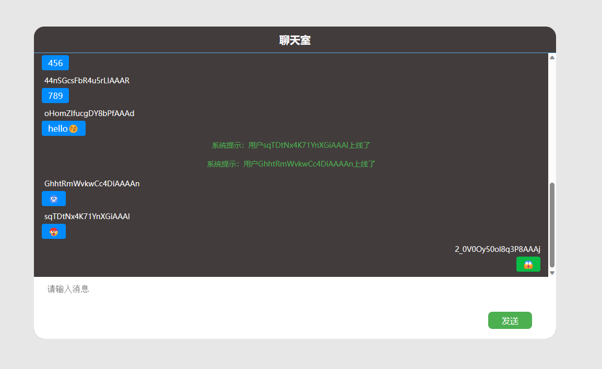

## 实现效果


## 服务端
- 引入socket.io来创建一个聊天服务
- 配置cors允许跨域
- 监听链接创建，发送用户上线提醒
- 接受消息广播到其它用户
```js
const { Server } = require("socket.io")

const io = new Server({
    cors: ['http://localhost:8080']
})

io.on("connection", socket => {
    console.log(`新窗口${socket.id}连接`)
    socket.broadcast.emit('login-remind', `系统提示：用户${socket.id}上线了`)
    socket.on('send-message', obj => {
        console.log(`收到来自${obj.userId}的消息：${obj.text}`)
        socket.broadcast.emit('receive-message',obj)
    })
})

io.listen(3000) 
```

## 用户端
### 关键代码
```js
const socket = io("http://localhost:3000")
var chat = ''
var userId = ''

socket.on('connect', () => {
    console.log(`socket连接成功,用户id为${socket.id}`)
    userId = socket.id
})

socket.on('login-remind', info => {
    console.log(info)
    chat.remind(info)
})

socket.on('receive-message', obj => {
    console.log(`收到来自${obj.userId}的消息：${obj.text}`)
    chat.sendMsg(obj)
    chat.sendSuccess()
})

function sendMessage() {
    const value = chat.input.value
    if (value.trim() == '') return
    let msg = {
        userId: userId,
        text: value
    }
    chat.sendMsg(msg)
    chat.sendSuccess()
    socket.emit('send-message', msg)
}

window.onload = function () {
    let list = JSON.parse(localStorage.getItem('chatList')) || []
    chat = new Chat(list)
    chat.createHtml()
}
```
### 类构造
```js
var html = ''
var type = ''
class Chat {
    constructor(arr) {
        this.list = arr
        this.dom = document.querySelector('.chat-content-log')
        this.input = document.getElementById('input')
    }
    createHtml() {
        for(let item of this.list) {
            this.addChatLog(item)
        }
        this.sendSuccess()
    }
    remind(info) {
        let node = document.createElement('div')
        node.className = "chat-remind"
        node.textContent = info
        this.dom.appendChild(node)
        html = this.dom.innerHTML
    }
    addChatLog(item) {
        if (item.userId == userId) {
            type = 'sender'
        } else {
            type = 'putaway'
        }
        html += `
            <div class="${type}">
                <div class="msg-info-content">
                    <p class="msg-info-content-name">${item.userId}</p>
                    <p class="msg-info-content-text">${item.text}</p>
                </div>
            </div>
        `
        this.dom.innerHTML = html
    }
    sendMsg(item) {
        this.list.push(item)
        localStorage.setItem('chatList',JSON.stringify(this.list))
        this.addChatLog(item)
    }
    sendSuccess() {
        this.dom.scrollTop = this.dom.scrollHeight
        this.input.value = ''
        this.input.focus()
    }
}
```