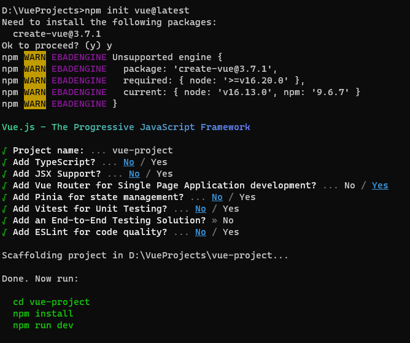
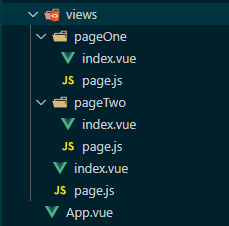
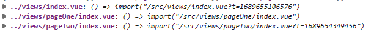
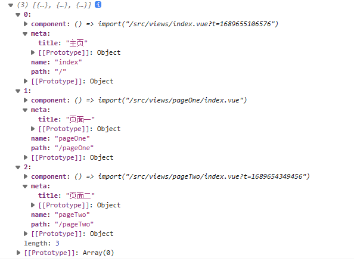

::: tip 全新的路由组织方式
- 以往编写路由都需要手动编写router.js代码，其实很多代码是重复的
- 新的方案根据文件夹目录结构自动生成
- 文件夹下的 index.vue -> /
:::

## 初始化项目
### 构建
```js
npm init vue@latest
```

### 运行
```js
npm run dev
```

### 项目结构
- 一个文件夹对应一个路由
- page.js用来填写配置信息
```js
export default {
    title: ''
}
```


## Glob导入
- Vite 支持使用特殊的 import.meta.glob 函数从文件系统导入多个模块
- 匹配到的文件默认是懒加载的，通过动态导入实现，并会在构建时分离为独立的 chunk
### 获取路由相关配置
```js
const pages = import.meta.glob('../views/**/page.js', {
  eager: true,
  import: 'default'
})
const pageComps = import.meta.glob('../views/**/index.vue')
```
- pages
```js
{
    "../views/page.js": {
        "title": "主页"
    },
    "../views/pageOne/page.js": {
        "title": "页面一"
    },
    "../views/pageTwo/page.js": {
        "title": "页面二"
    }
}
```
- pageComps


### 生成路由
```js
const routes = Object.entries(pages).map(([path,meta]) => {
  const pathJSPath = path
  path = path.replace('../views','').replace('/page.js','') || '/'
  const name = path.split('/').filter(Boolean).join('-') || 'index'
  const comPath = pathJSPath.replace('page.js','index.vue')
  return {
    path,
    name,
    component: pageComps[comPath],
    meta
  }
})
```



::: warning 总结
通过以上代码已经实现路由自动生成，但该方式不能生成嵌套路由
:::