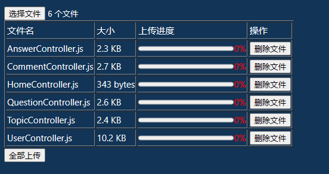
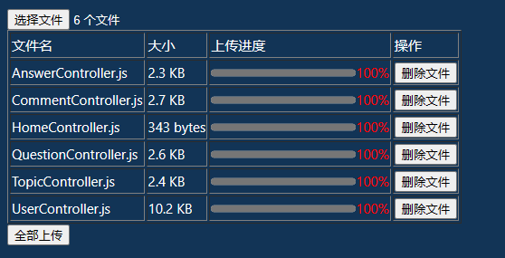

## 实现步骤
1. 创建一个`input`标签，设置`type="file" multiple=true`，并添加`@change`事件，用于监听文件上传
2. 将文件列表存储到`fileList`变量中，用于后续上传操作
3. 自定义`returnFileSize`方法，用于计算文件大小
4. 遍历文件列表，调用`axios`的`post`方法，将文件上传到服务器

## 代码实现
```vue
<script setup>
import { ref } from 'vue'
import axios from 'axios'

const progress = ref(0)
const fileList = ref([])
const onFileChange = e => {
    for (let file of e.target.files) {
        fileList.value.push({
            file: file,
            progress: 0
        })
    }
}
const uoloadFile = (file,index) => {
    const formData = new FormData()
    formData.append('file', file)
    axios.post('http://localhost:3000/upload', formData, {
        onUploadProgress: progressEvent => {
            fileList.value[index].progress = (progressEvent.loaded / progressEvent.total) * 100
        }
    }).then(res => {
        console.log(res)
    }).catch(err => {
        console.error(err)
    })
}
const deleteFile = index => {
    fileList.value.splice(index, 1)
}
const uploadAll = () => {
    fileList.value.forEach((item,index) => {
        uoloadFile(item.file,index)
    })
}
const returnFileSize = size => {
  if (size < 1024) {
    return `${size} bytes`;
  } else if (size >= 1024 && size < 1048576) {
    return `${(size / 1024).toFixed(1)} KB`;
  } else if (size >= 1048576) {
    return `${(size / 1048576).toFixed(1)} MB`;
  }
}
</script>

<template>
<div class="container">
    <input type="file" multiple @change="onFileChange" />
    <table border>
        <tr>
            <td>文件名</td>
            <td>大小</td>
            <td>上传进度</td>
            <td>操作</td>
        </tr>
        <tr v-for="(item,index) in fileList">
            <td>{{ item.file.name }}</td>
            <td>{{ returnFileSize(item.file.size) }}</td>
            <td>
                <progress :max="100" :value.prop="item.progress" style="width: 160px;"></progress>
                <p style="color: red;text-align: center;">{{ item.progress }}%</p>
            </td>
            <td>
                <button @click="deleteFile(index)">删除文件</button>
            </td>
        </tr>
    </table>
    <button @click="uploadAll">全部上传</button>
</div>
</template>
```
## 实现效果



