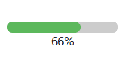

## 介绍
- 单文件上传
- 自定义文件上传前的钩子
- 文件上传进度条
- 文件上传成功,失败处理
- 使用`vue3`+`ts`

## 代码实现
### 文件上传容器
- 使用按钮覆盖`input`
- 添加`ref`属性,用于获取`input`元素
- 监听文件选择,获取文件
```vue
<template>
  <button @click.prevent="handleFileUpload">点击上传</button>
  <input type="file" id="inputUpload" ref="fileInput" @change="handleFileChange"/>
</template>

<script setup lang="ts">
const fileInput = ref<null | HTMLInputElement>(null)

const handleFileUpload = () => {
  if (fileInput.value) {
    fileInput.value.click()
  }
}

const handleFileChange = (event: Event) => {
  const file = (event.target as HTMLInputElement).files?.[0]
}
</script>

<style>
#inputUpload {
  display: none;
}
</style>
```
### 定义组件
- 定义`props`,`emits`
  - 上传地址
  - 上传前的钩子
  - 上传后的回调
- 定义文件上传状态
- 定义进度条
```ts
type UploadStatus = 'ready' | 'uploading' | 'success' | 'error'
type CheckFunction = (file: File) => boolean

const props = defineProps({
  action: {
    type: String,
    required: true
  },
  beforeUpload: {
    type: Function as PropType<CheckFunction>
  }
})
const emits = defineEmits(['upload-success', 'upload-error'])

const fileStatus = ref<UploadStatus>('ready')
const uploadedURL = ref<string>('')
const progress = ref<number>(0)
```
### 修改上传按钮样式
- 使用插槽将上传成功的图片地址返回给父组件
- 使用`progress`显示进度条
```html
<div class="file-upload-container" @click.prevent="handleFileUpload">
  <slot v-if="fileStatus === 'uploading'" name="uploading">
    <div class="progress-box">
      <progress :max="100" :value.prop="progress" id="progressBar"></progress>
      <p>{{ progress }}%</p>
    </div>
  </slot>
  <slot v-else-if="fileStatus === 'success'" name="uploaded" :uploadedURL="uploadedURL">
    <button>上传成功</button>
  </slot>
  <slot v-else name="default">
    <button>点击上传</button>
  </slot>
</div>
```
```css
.file-upload-container {
  display: inline-block;
}
.file-upload-container button {
  border: 2px dashed #ccc;
  width: 160px;
  height: 160px;
  border-radius: 15px;
}
.file-upload-container button:hover {
  border-color: #1890ff;
}
.progress-box {
  width: 160px;
  height: 160px;
  display: flex;
  flex-direction: column;
  justify-content: center;
}
.progress-box p {
  text-align: center;
}
#progressBar {
  background-color: #ccc;
  border-radius: 10px;
}
#progressBar::-webkit-progress-bar {
  background-color: #ccc;
  border-radius: 10px;
}
#progressBar::-webkit-progress-value {
  background-color: #5cb85c;
  border-radius: 10px;
}
```
### 上传方法
```ts
const handleFileChange = (event: Event) => {
  const file = (event.target as HTMLInputElement).files?.[0]
  if (file) {
    if (props.beforeUpload) {
      const result = props.beforeUpload(file)
      if (!result) return
    }
    fileStatus.value = 'uploading'
    const formData = new FormData()
    formData.append('file', file)
    axios.post(props.action, formData, {
      headers: {
        'Content-Type': 'multipart/form-data'
      },
      onUploadProgress: (progressEvent: AxiosProgressEvent) => {
        progress.value = Math.floor((progressEvent.loaded / (progressEvent.total as number)) * 100)
      }
    }).then(res => {
      fileStatus.value = 'success'
      uploadedURL.value = res.data.url
      emits('upload-success', res.data.url)
    }).catch(err => {
      fileStatus.value = 'error'
      emits('upload-error', err.message)
    }).finally(() => {
      if (fileInput.value) {
        fileInput.value.value = ''
        progress.value = 0
      }
    })
  }
}
```
## 使用组件
### template
```html
<file-uploader
  action="http://localhost:3000/upload"
  :beforeUpload="beforeUpload"
  @upload-success="onUploadSuccess"
  @upload-error="onUploadError"
>
<template #uploaded="dataProps">
  
</template>
</file-uploader>
```
### script
```ts
import FileUploader from '@/components/FileUploader.vue'

const beforeUpload = (file: File) => {
  const isJPG = file.type === 'image/jpeg'
  const isPNG = file.type === 'image/png'
  const isLt2M = file.size / 1024 / 1024 < 2

  if (!isJPG && !isPNG) {
    console.error('上传头像只能是 JPG 或 PNG 格式!')
  }
  if (!isLt2M) {
    console.error('上传图片大小不能超过 2MB!')
  }
  return (isJPG || isPNG) && isLt2M
}

const onUploadSuccess = (e: string) => {
  console.log('文件上传成功' + e)
}

const onUploadError = (e: string) => {
  console.log('文件上传失败' + e)
}
```
### 效果


