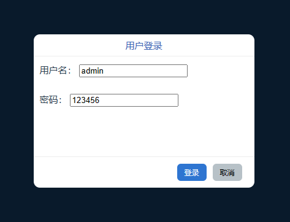

## app.config.globalProperties
- 用于注册能够被应用内所有组件实例访问到的全局属性的对象
- 这是对vue2.x中`Vue.prototype`的替代
### 注册全局属性
```js
app.config.globalProperties.message = {
    name:"全局属性",
    date: new Date()
}
```
### 访问全局属性
```js
console.log(proxy.message)
// { name: '全局属性', date: 'Thu Aug 03 2023 10:53:58 GMT+0800 (中国标准时间)' }
```
### 注册全局方法
```js
app.config.globalProperties.$test = e => {
    console.log(e)
}
```
### 使用全局方法
```vue
<script setup>
import { getCurrentInstance } from 'vue';

const { proxy } = getCurrentInstance()

proxy.$test("调用全局方法")

</script>
```

## 全局封装弹窗
### Dialog组件
```vue
<script setup>
import { reactive } from 'vue'

defineProps({
  title: {
    type: String,
    default: '弹窗'
  },
  width: {
    type: Number,
    default: 300,
    validator(value) {
      return value >= 300
    }
  },
  height: {
    type: Number,
    default: 200,
    validator(value) {
      return value >= 200
    }
  },
  marginTop: {
    type: Number,
    default: 0
  },
  confirmBtnText: {
    type: String,
    default: '确认'
  },
  cancelBtnText: {
    type: String,
    default: '取消'
  }
})
const emit = defineEmits(['confirm','cancel'])

const form = reactive({
  name: '',
  password: ''
})
</script>

<template>
  <div class="dialog">
    <div class="content" :style="{
      width: width + 'px',
      height: height + 'px',
      marginTop: marginTop + 'px'
    }">
      <div class="title">
        {{ title }}
      </div>
      <div class="main">
        用户名： <input v-model="form.name" /><br/><br/>
        密码： <input v-model="form.password" />
      </div>
      <div class="footer">
        <button @click="emit('confirm',form)">{{ confirmBtnText }}</button>
        <button @click="emit('cancel')">{{ cancelBtnText }}</button>
      </div>
    </div>
  </div>
</template>
```
### 注册方法
```js
app.config.globalProperties.$dialog = (e, callBack) => {
    const div = document.createElement('div')
    document.body.appendChild(div)
    const close = () => {
        dialog.unmount(div)
        div.remove()
    }
    const dialog = createApp(Dialog, {
        ...e,
        onConfirm(e) {
            callBack({
                name: e.name,
                password: e.password
            })
            close()
        },
        onCancel() {
            close()
        }
    })
    dialog.mount(div)
}
```
### 使用
```vue
<script setup>
import { getCurrentInstance } from 'vue';

const { proxy } = getCurrentInstance()

const open = () => {
    proxy.$dialog({
        title: '用户登录',
        width: 360,
        height: 250,
        confirmBtnText: '登录'
    }, e => {
        console.log(e)
    })
}
</script>
```

- 效果


- 点击确定后的回调
```js
{
    "name": "admin",
    "password": "123456"
}
```