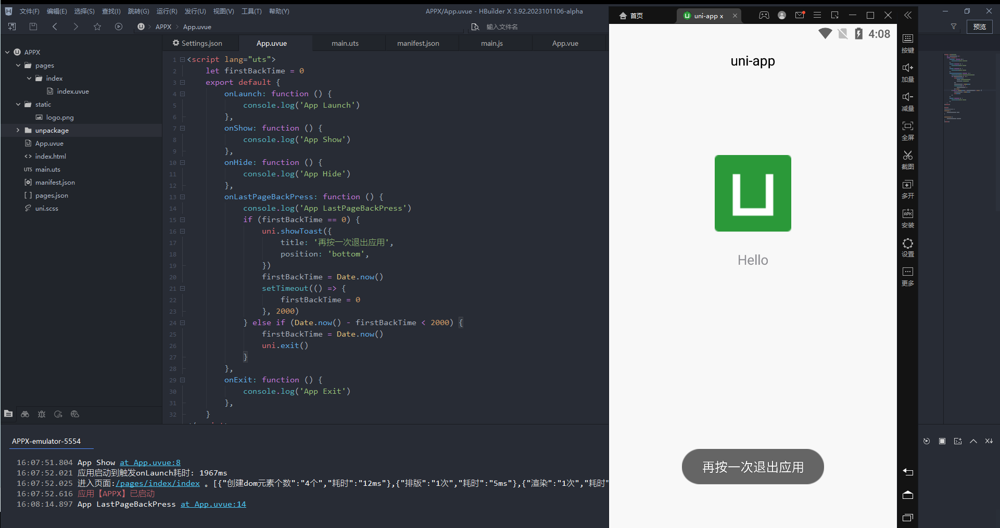
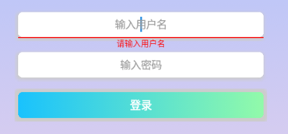

## 快速开始
### 准备开发工具
- 安装最新版 HBuilderX
  - [下载地址](https://www.dcloud.io/hbuilderx.html#download_alpha)
### 新建项目
- 选择 uni-app 项目
- 勾选 uni-app x
### 配置adb路径
- 点击工具栏的工具 -> 设置
- 运行配置 -> adb路径
- 选择 adb 路径
- HBuilderX/plugins/launcher-tools/tools/adbs/adb.exe
### 运行项目
- 点击工具栏的运行 -> 运行到手机或模拟器



## 项目配置
### 分包
- 新建分包文件夹
- 修改项目根目录下 `manifest.json`
```json
"pages": [
  {
    "path": "pages/index/index",
    "style": {
      "navigationBarTitleText": "uni-app"
    }
  }
],
"subPackages": [{
  "root": "subPages",
  "pages": [
    {
      "path": "pages/login/login",
      "style": {
        "enablePullDownRefresh": false,
        "navigationStyle": "custom"
      }
    }
  ]
}]
```
- 页面跳转
```js
uni.navigateTo({
  url: '/subPages/pages/login/login'
})
```
### 全局变量 && 状态管理
- 新建 `store` 文件夹, 新建 `index.uts` 文件
- 使用 `statusBarHeight` 记录设备状态栏高度
```ts
import { reactive } from 'vue'

export type State = {
	statusBarHeight: number
}

export const state = reactive({
	statusBarHeight: 0
} as State)

export const setStatusBarHeight = (num: number) => {
	state.statusBarHeight = num
}
```
- 在 `App.uvue` 中获取设备状态栏高度
```js
import { setStatusBarHeight } from '@/store/index.uts'

export default {
  onLaunch: function () {
    setStatusBarHeight(uni.getSystemInfoSync().statusBarHeight)
  }
}
```
- 其它页面使用变量
```js
import { state } from '@/store/index.uts'

export default {
  computed: {
    barHeight(): number {
      return state.statusBarHeight
    }
  }
}
```
### 封装组件
- 将状态栏占位view封装为 `status-bar` 组件
- 在 `components` 下新建组件
```vue
<template>
	<view :style="{
		height: barHeight + 'px',
		backgroundColor: bgColor
		}">
	</view>
</template>

<script>
	import { state } from '@/store/index.uts'
	export default {
		name:"status-bar",
		computed: {
			barHeight(): number {
				return state.statusBarHeight
			}
		},
		props: {
			bgColor: {
				type: String,
				default: 'transparent'
			}
		}
	}
</script>
```
- 使用组件
```vue
<status-bar bgColor="#00aaff"></status-bar>
```

## 简单实现登录表单
### 页面实现
- 使用 `@input` 替换输入框的值
- 使用 `ref` 获取dom
- `setProperty`: 对CSS指定样式设置一个新值或更新
- 通过设置样式，实现输入框的错误提示



```vue
<template>
	<view class="login-container">
		<view class="login-form">
			<input :value="username" placeholder="输入用户名" class="input" @input="usernameChange"/>
			<text ref="usernameVerify" class="input-verify">请输入用户名</text>
			<input :value="password" placeholder="输入密码" password="true" class="input" @input="passwordChange"/>
			<text ref="passwordVerify" class="input-verify">请输入密码</text>
			<button class="login-btn" hover-class="login-btn-hover" size="mini" @click="login">登录</button>
		</view>
	</view>
</template>

<script lang="uts">
	export default {
		data() {
			return {
				username: '',
				password: '',
				usernameVerify: null as Element | null,
				passwordVerify: null as Element | null
			}
		},
		onReady() {
			this.usernameVerify = this.$refs['usernameVerify'] as Element
			this.passwordVerify = this.$refs['passwordVerify'] as Element
		},
		methods: {
			usernameChange(event: InputEvent): void {
				this.username = event.detail.value
				this.usernameVerify?.style?.setProperty('opacity', '0')
			},
			passwordChange(event: InputEvent): void {
				this.password = event.detail.value
				this.passwordVerify?.style?.setProperty('opacity', '0')
			},
			login() {
				if (this.username.trim() == '') {
					this.usernameVerify?.style?.setProperty('opacity', '1')
					return uni.showToast({
						title: '请输入用户名',
						icon: 'none'
					})
				}
				if (this.password.trim() == '') {
					this.passwordVerify?.style?.setProperty('opacity', '1')
					return uni.showToast({
						title: '请输入密码',
						icon: 'none'
					})
				}
			}
		}
	}
</script>
```
### 发起登录请求
- url 不能写localhost，否则会报错
- 不能使用解构 `success({ data })`
- 将返回值定义为 `UTSJSONObject` 类型
```js
uni.showLoading({
	title: '登录中...'
})
uni.request({
	url: 'http://192.168.137.1:8083/login',
	method: 'POST',
	header: {
		"Content-Type": "application/json"
	},
	dataType: 'json',
	data: {
		username: this.username,
		password: this.password
	},
	sslVerify: false,
	success(res) {
		const data = res.data as UTSJSONObject
		if (data == null) return
		uni.showToast({
			title: data.getString('msg') as string,
			icon: data.getNumber('code') == 200 ? 'success' : 'error'
		})
	},
	fail(err) {
		console.log(err)
	},
	complete() {
		uni.hideLoading()
	}
})
```